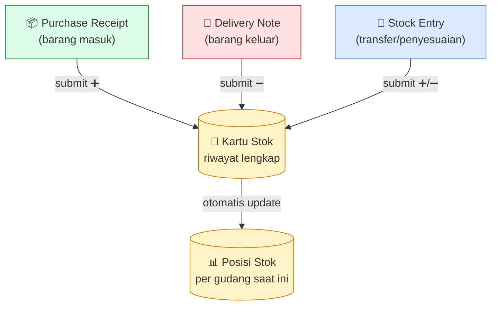
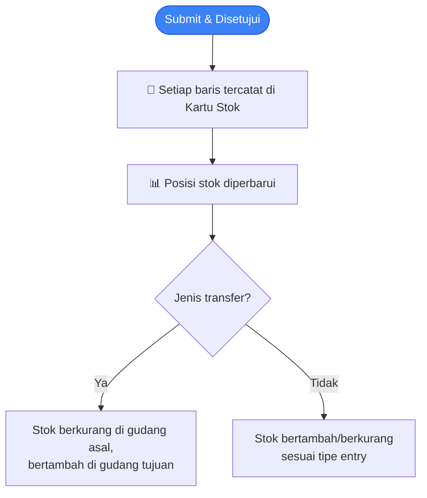
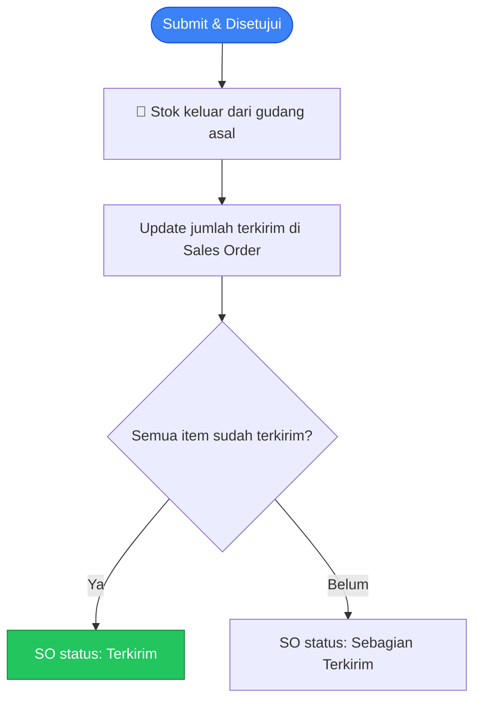
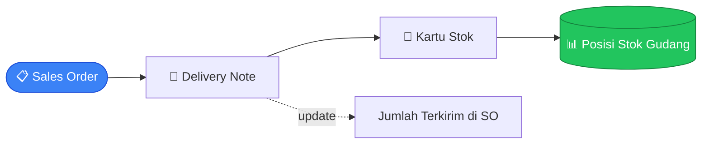

# Modul Inventory

> Dokumentasi modul inventory: Items, Warehouses, Stock Entries, Delivery Notes, Stock Ledger.

## Daftar Isi

- [Gambaran Modul](#gambaran-modul)
- [Korelasi Antar-Feature](#korelasi-antar-feature)
- [Item & Variant](#item--variant)
- [Image Uploader](#image-uploader)
- [Warehouse](#warehouse)
- [Stock Entry](#stock-entry)
- [Delivery Note](#delivery-note)
- [Stock Ledger](#stock-ledger)
- [Categories, Units, Attributes](#categories-units-attributes)
- [Business Flow Stok](#business-flow-stok)
- [Flow Retur (returnAgainst)](#flow-retur-returnagainst)

---

## Gambaran Modul

Modul Inventory mengelola semua hal yang berkaitan dengan item, stok, gudang, dan pergerakan barang.

**Yang dikelola modul ini:**

| Konsep | Fungsi |
|---|---|
| Item & Variant | Master produk dan SKU konkretnya |
| Warehouse | Lokasi penyimpanan stok |
| Stock Entry | Pergerakan stok manual (transfer, penyesuaian) |
| Delivery Note | Pengiriman barang ke customer |
| Stock Ledger | Riwayat lengkap semua pergerakan stok |

---

## Korelasi Antar-Feature

Semua pergerakan stok tercatat di satu **kartu stok** (riwayat yang tidak bisa diubah) yang selalu memperbarui **posisi stok** terkini per gudang. Ada tiga sumber pergerakan:

| Dokumen Sumber | Berasal Dari | Arah Stok |
|---|---|---|
| Purchase Receipt | [Purchase Order](purchase.md#purchase-order) | **Masuk** ke gudang tujuan |
| Delivery Note | [Sales Order](sales.md#sales-order) | **Keluar** dari gudang asal |
| Stock Entry | Dibuat manual, atau dari Internal Order | Transfer / penyesuaian (bisa masuk atau keluar) |

> Penilaian harga pokok barang memakai metode **FIFO** — lihat [Valuation FIFO](#valuation-fifo). Korelasi penuh sisi dokumen: [Sales · Korelasi](sales.md#korelasi-antar-feature) · [Purchase · Korelasi](purchase.md#korelasi-antar-feature).

---

## Item & Variant

> **Konsep kunci:** **Item** adalah produk master, **Variant** adalah SKU konkret turunannya. **Semua dokumen transaksi (SO/PO/Delivery Note/Invoice/Stock Entry) memilih Variant, bukan Item** — misalnya "Kaos Polos" adalah item, sedangkan "Kaos Polos - Merah, Size L" adalah variant-nya. Stok dan barcode juga menempel ke variant, bukan ke item induknya.

### Item

Item adalah produk atau jasa yang diperjualbelikan atau dikelola stoknya.

| Field | Deskripsi |
|---|---|
| Kode, Nama | Identitas item |
| Deskripsi | Keterangan item |
| Kategori | Kategori item |
| Satuan Dasar | Satuan default item |
| Faktor Konversi | Faktor konversi satuan default |
| Stok Minimum | Batas minimum stok sebelum perlu restock |
| Foto | Gambar produk |
| Status Aktif | Apakah item masih dipakai |
| Track Stok | Apakah stok item ini dipantau sistem |
| Boleh Substitusi | Apakah item ini bisa digantikan item alternatif |
| Tipe | Produk atau jasa |
| Format Nama Variant | Pola penamaan variant otomatis |

### Item Variant

Setiap item dapat memiliki satu atau lebih variant (kombinasi atribut seperti ukuran, warna).

| Field | Deskripsi |
|---|---|
| Kode | Kode variant (SKU) |
| Item Induk | Item master asal variant ini |
| Kategori | Kategori |
| Satuan Default | Satuan default variant |
| Atribut | Kombinasi atribut (mis. warna, ukuran) |
| Foto | Gambar variant (lihat [Image Uploader](#image-uploader)) |
| Status Aktif | Apakah variant masih dipakai |

### Konversi Satuan

Setiap item dapat memiliki beberapa satuan dengan faktor konversi berbeda (mis. 1 Dus = 12 Pcs).

### Item Alternative (Substitusi)

Menghubungkan satu item dengan alternatif penggantinya — bisa dipakai dua arah, artinya kedua item bisa saling menggantikan.

### Barcode

Barcode bisa didaftarkan per variant dan per satuan, untuk mempercepat pencarian saat input transaksi.

### Image Uploader

Item dan ItemVariant bisa diberi foto produk — pola upload/preview/hapus gambar yang sama juga dipakai di halaman User dan Company. Detail lengkap pola ini: [Core · Image Uploader (Generik)](core.md#image-uploader-generik).

---

## Warehouse

Gudang tempat penyimpanan stok.

| Field | Deskripsi |
|---|---|
| Kode, Nama | Identitas gudang |
| Branch | Cabang pemilik gudang |
| Penanggung Jawab | User yang bertanggung jawab atas gudang ini |

---

## Stock Entry

Stock Entry adalah dokumen pergerakan stok untuk kebutuhan internal — dipakai untuk:
- Penerimaan barang di luar alur pembelian normal
- Pengeluaran barang
- Transfer antar gudang
- Penyesuaian stok (stock opname)
- Retur barang

### Fields Utama

| Field | Deskripsi |
|---|---|
| Kode | Kode dokumen (dibuat otomatis) |
| Tipe | Terima, keluar, transfer, penyesuaian, dll. |
| Tanggal | Tanggal transaksi |
| Pakai Gudang Transit | Apakah barang transfer lewat gudang transit dulu |
| Catatan | Catatan tambahan |
| Total Nilai Masuk / Keluar | Total nilai barang yang bergerak |
| Akun Selisih | Akun pembukuan untuk selisih nilai (jika ada) |
| Baris Item | Daftar barang yang bergerak |

### Baris Item Stock Entry

| Field | Deskripsi |
|---|---|
| Item | Barang yang bergerak |
| Gudang Asal | Untuk transfer/pengeluaran |
| Gudang Tujuan | Untuk transfer/penerimaan |
| Jumlah | Jumlah barang |
| Satuan | Satuan pengukuran |
| Harga Pokok | Nilai dasar barang |
| Biaya Tambahan | Biaya tambahan (ongkir, dll.) |
| Harga Pokok Akhir | Harga pokok final (dihitung FIFO) |
| Total Nilai | Total nilai baris |

### Apa yang Terjadi Saat Stock Entry Disubmit

> Harga pokok barang dihitung menggunakan metode **FIFO** (First In First Out) — barang yang masuk lebih dulu dianggap keluar lebih dulu.

### Alur Status

Draft → Diajukan → Menunggu Persetujuan → Disetujui → (stok berubah)

Jika ditolak atau dibatalkan, semua perubahan stok yang sudah terjadi otomatis dikembalikan (reverse).

---

## Delivery Note

Delivery Note (Surat Jalan) adalah dokumen pengiriman barang ke customer.

### Fields Utama

| Field | Deskripsi |
|---|---|
| Kode | Kode dokumen (dibuat otomatis) |
| Tanggal Pengiriman | Kapan barang dikirim |
| Customer | Penerima barang |
| Cabang Customer | Cabang tujuan pengiriman |
| Dokumen Sumber | Biasanya Sales Order asalnya |
| Catatan Eksternal | Catatan tambahan untuk customer |
| Baris Item | Barang yang dikirim |

### Baris Item Delivery Note

| Field | Deskripsi |
|---|---|
| Item (Variant) | Barang yang dikirim |
| Gudang Asal | Gudang tempat barang diambil |
| Satuan | Satuan pengukuran |
| Jumlah Dikirim | Jumlah barang yang dikirim |
| Jumlah Dikembalikan | Terisi jika ini dokumen retur |

> Delivery Note selalu menunjuk ke dokumen sumbernya (umumnya Sales Order), dan tiap barisnya memilih Variant dari item.

### Apa yang Terjadi Saat Delivery Note Disubmit

> Jika dokumen ini adalah **retur** (barang dikembalikan customer), arah stoknya terbalik — lihat [Flow Retur](#flow-retur-returnagainst).

---

## Stock Ledger

Kartu Stok adalah riwayat lengkap dan permanen setiap perubahan stok — tidak bisa diubah atau dihapus setelah tercatat, sehingga selalu bisa dilacak kembali riwayat stok suatu barang dari waktu ke waktu.

Setiap entri menyimpan:
- Dokumen sumber yang menyebabkan perubahan
- Item dan gudang terkait
- Jumlah perubahan (bertambah/berkurang)
- Stok setelah perubahan tercatat
- Harga pokok per unit saat itu

> Halaman ini **hanya untuk dilihat** — tidak ada input manual, karena seluruh catatan dibuat otomatis oleh sistem.

---

## Categories, Units, Attributes

### Categories

Kategori item — bisa disusun berjenjang (parent-child) untuk pengelompokan yang lebih terstruktur.

### Units

Satuan pengukuran. Bisa dikelompokkan dalam satu grup (mis. grup "Berat": Kg, Gram, Ton).

| Field | Deskripsi |
|---|---|
| Kode, Nama | Identitas satuan |
| Grup | Kelompok satuan yang bisa saling dikonversi |
| Faktor Konversi | Faktor konversi ke satuan dasar grup |
| Satuan Default | Apakah ini satuan default grupnya |

### Attributes

Atribut kustom item (ukuran, warna, dll.) yang dipakai untuk membentuk kombinasi Variant.

| Field | Deskripsi |
|---|---|
| Nama | Nama atribut |
| Deskripsi | Keterangan atribut |
| Bertipe Angka | Apakah nilainya berupa angka |
| Daftar Nilai | Pilihan nilai yang valid untuk atribut ini |

---

## Business Flow Stok

### Alur Masuk Stok (Pembelian)

### Alur Keluar Stok (Penjualan)

### Valuation FIFO

Setiap kali stok masuk, nilai dan jumlahnya dicatat sebagai satu "antrian" tersendiri.

Saat stok keluar, harga pokok dihitung dengan metode **FIFO** (First In First Out):
1. Barang yang masuk **paling lama** diambil/dipakai terlebih dahulu.
2. Harga pokok dihitung dari rata-rata tertimbang barang yang diambil.
3. Antrian diperbarui setelah pengambilan.

---

## Flow Retur (returnAgainst)

Dari sisi stok, retur membalik arah pergerakan:

| Dokumen Retur | Arah Stok | Efek |
|---|---|---|
| **Delivery Note Retur** | **Masuk kembali** ke gudang asal | Jumlah dikembalikan pada DN asli bertambah; status Sales Order disesuaikan |
| **Purchase Receipt Retur** | **Keluar** (dikembalikan ke supplier) | Jumlah dikembalikan pada Purchase Receipt asli bertambah; status Purchase Order disesuaikan |

Detail akuntansi & alur lengkap: [Sales · Flow Retur](sales.md#flow-retur-returnagainst) · [Purchase · Flow Retur](purchase.md#flow-retur-returnagainst). Saat dokumen retur dibatalkan, efeknya di Kartu Stok otomatis dikembalikan (reversal).

---

## Related Documents

| Topik | Dokumen |
|---|---|
| Sumber Delivery Note | [Sales · Sales Order](sales.md#sales-order) |
| Sumber Purchase Receipt (stok masuk) | [Purchase · Purchase Order](purchase.md#purchase-order) |
| Ditagih bersama pengiriman | [Finances · Sales Invoice](finances.md) |
| Approval (Stock Entry & DN) | [Core · Approval](core.md#approval) |
