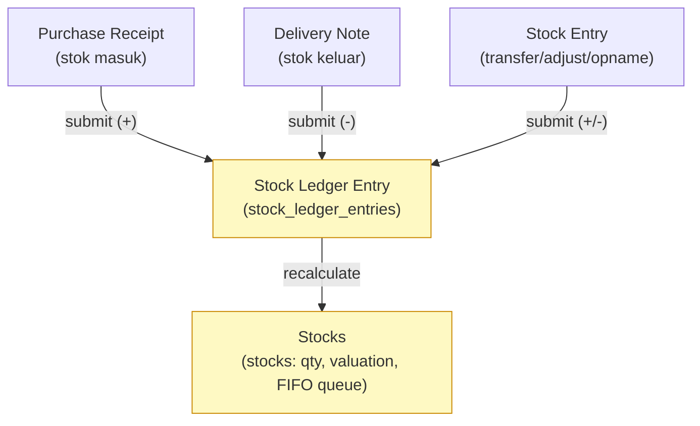
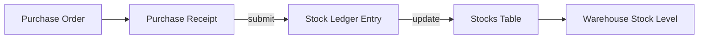
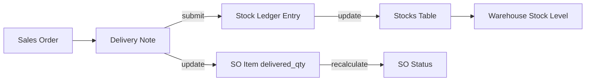

# Modul Inventory

> Dokumentasi modul inventory: Items, Warehouses, Stock Entries, Delivery Notes, Stock Ledger.

## Daftar Isi

- [Gambaran Modul](#gambaran-modul)
- [Korelasi Antar-Feature](#korelasi-antar-feature)
- [Item & Variant](#item--variant)
- [Image Uploader](#image-uploader)
- [Warehouse](#warehouse)
- [Stock Entry](#stock-entry)
- [Delivery Note](#delivery-note)
- [Stock Ledger](#stock-ledger)
- [Categories, Units, Attributes](#categories-units-attributes)
- [Business Flow Stok](#business-flow-stok)
- [Flow Retur (returnAgainst)](#flow-retur-returnagainst)

---

## Gambaran Modul

Modul Inventory mengelola semua hal yang berkaitan dengan item, stok, gudang, dan pergerakan barang.

**Model utama:**

| Model | Tabel | Submitable |
|---|---|---|
| `Item` | `items` | Tidak |
| `ItemVariant` | `item_variants` | Tidak |
| `ItemUnit` | `item_units` | — |
| `ItemAlternative` | `item_alternatives` | Tidak |
| `Warehouse` | `warehouses` | Tidak |
| `Stock` | `stocks` | — |
| `StockEntry` | `stock_entries` | Ya |
| `StockEntryItem` | `stock_entry_items` | — |
| `StockLedgerEntry` | `stock_ledger_entries` | — |
| `DeliveryNote` | `delivery_notes` | Ya |
| `DeliveryNoteItem` | `delivery_note_items` | — |
| `Category` | `categories` | Tidak |
| `Unit` | `units` | Tidak |
| `Attribute` | `attributes` | Tidak |

**Services:** `ItemServices`, `StockEntryService`, `DeliveryNoteService`, `StockService`

---

## Korelasi Antar-Feature

Semua pergerakan stok bermuara ke **`stock_ledger_entries`** (log immutable) yang meng-update **`stocks`** (posisi per variant per warehouse). Tiga dokumen sumber:

| Dokumen sumber | Asal | Arah stok | Modul |
|---|---|---|---|
| Purchase Receipt | [Purchase Order](purchase.md#purchase-order) | **Masuk** ke `target_warehouse` | [Purchase](purchase.md) |
| Delivery Note | [Sales Order](sales.md#sales-order) | **Keluar** dari `source_warehouse` | Inventory ↔ Sales |
| Stock Entry | manual / internal order | transfer / adjust (+/-) | Inventory |

> Valuasi memakai **FIFO** via `stock_queue` (lihat [Valuation FIFO](#valuation-fifo)). Korelasi penuh sisi dokumen: [Sales · Korelasi](sales.md#korelasi-antar-feature) · [Purchase · Korelasi](purchase.md#korelasi-antar-feature).

---

## Item & Variant

> **Konsep kunci:** `Item` = master produk; `ItemVariant` = SKU konkret turunannya. **Semua baris dokumen transaksi (SO/PO/DN/Invoice/Stock Entry) me-reference `ItemVariant`, bukan `Item`** (kolom `item_id` pada `*_items` → tabel `item_variants`). Stok (`stocks`) & barcode juga menempel ke variant. Lihat [Database · Item & ItemVariant](../database.md#item--itemvariant).

### Item

Item adalah produk atau jasa yang diperjualbelikan atau dikelola stoknya.

| Field | Tipe | Deskripsi |
|---|---|---|
| `code` | string | Kode item |
| `name` | string | Nama item |
| `description` | text | Deskripsi |
| `category` | relation | Kategori item |
| `default_unit` | relation | Satuan default |
| `conversion_factor` | double | Faktor konversi default unit |
| `stock_minimum` | int | Minimum stok |
| `image` | relation | Gambar item |
| `is_disabled` | boolean | Status aktif |
| `is_stock_item` | boolean | Apakah stok di-track |
| `allow_alternative_item` | boolean | Boleh substitusi |
| `type` | string | Tipe item (product, service, dll.) |
| `format_variant` | string | Format nama variant otomatis |
| `units` | hasMany | Semua konversi unit |
| `variants` | hasMany | Semua variant |

### Item Variant

Setiap item dapat memiliki satu atau lebih variant (kombinasi atribut seperti ukuran, warna).

| Field | Tipe | Deskripsi |
|---|---|---|
| `code` | string | Kode variant |
| `item` | relation | Item induk |
| `category` | relation | Kategori |
| `default_unit` | relation | Satuan default variant |
| `attributes` | hasMany | Atribut-nilai variant |
| `image` | relation | Gambar variant (lihat [Image Uploader](#image-uploader)) |
| `is_disabled` | boolean | Status aktif |

### Item Unit (Konversi Satuan)

Setiap item dapat memiliki beberapa satuan dengan faktor konversi berbeda.

| Field | Tipe | Deskripsi |
|---|---|---|
| `item_id` | FK | Item induk |
| `unit_id` | FK | Satuan |
| `conversion_factor` | double | Faktor konversi ke satuan dasar |
| `is_default` | boolean | Satuan default |

### Item Alternative (Substitusi)

Link antara item dengan alternatifnya. Bisa dua arah (`two_way`).

### Barcode

Barcode per item variant dan unit (`item_barcodes`).

### Image Uploader

Item dan ItemVariant memakai kolom `image` (FK ke [File](core.md#tags--files)) untuk foto produk — pola upload/preview/hapus yang sama juga dipakai di User dan Company. Detail lengkap pola ini: [Core · Image Uploader (Generik)](core.md#image-uploader-generik).

| Endpoint | Method | Keterangan |
|---|---|---|
| `/items/{item}/image` | POST | Upload gambar Item |
| `/items/{item}/image` | DELETE | Hapus gambar Item |
| `/itemVariants/{itemVariant}/image` | POST | Upload gambar ItemVariant |
| `/itemVariants/{itemVariant}/image` | DELETE | Hapus gambar ItemVariant |

> **Catatan migrasi**: kolom ini sebelumnya bernama `image_id` — sudah di-rename menjadi `image` agar konsisten dengan penamaan di `users.image`. UI memakai komponen Avatar + `UploadDialog.jsx` (lihat `Show.jsx`/`ShowVariant.jsx`).

### Routes — Item, ItemVariant, ItemAlternative

Item, ItemVariant, dan ItemAlternative memakai 12 route dasar [macro `resourceDetail`](../routes.md#konvensi-macro-routeresourcedetail) (non-submitable). Berikut expand penuh **Item** (`Inventory\ItemController`); ItemVariant & ItemAlternative identik polanya pada controller masing-masing.

| Method | URI | Route Name | Controller@method |
|---|---|---|---|
| GET | `/items` | `items.index` | `ItemController@index` |
| POST | `/items` | `items.store` | `ItemController@store` |
| GET | `/items/create/{ref?}` | `items.create` | `ItemController@create` |
| GET | `/items/{item}` | `items.show` | `ItemController@show` |
| PUT | `/items/{item}` | `items.update` | `ItemController@update` |
| DELETE | `/items/{item}` | `items.destroy` | `ItemController@destroy` |
| POST | `/items/{item}/comment` | `items.addComment` | `ItemController@addComment` |
| DELETE | `/items/{item}/comment/{id}` | `items.removeComment` | `ItemController@removeComment` |
| POST | `/items/{item}/tag` | `items.addTag` | `ItemController@addTag` |
| DELETE | `/items/{item}/tag/{id}` | `items.removeTag` | `ItemController@removeTag` |
| POST | `/items/{item}/file` | `items.addFile` | `ItemController@addFile` |
| DELETE | `/items/{item}/file/{id}` | `items.removeFile` | `ItemController@removeFile` |

**ItemVariant** (`Inventory\ItemVariantController`) — 12 route dasar `itemVariants.*` + tambahan:

| Method | URI | Route Name | Controller@method |
|---|---|---|---|
| POST | `/itemVariants/info` | `itemVariants.info` | `ItemVariantController@info` |

**ItemAlternative** (`Inventory\ItemAlternativeController`) — 12 route dasar `itemAlternatives.*`.

> Daftar 544 route lengkap: [Routes · Inventory](../routes.md#10-inventory).

---

## Warehouse

Gudang tempat penyimpanan stok.

| Field | Tipe | Deskripsi |
|---|---|---|
| `code` | string | Kode gudang |
| `name` | string | Nama gudang |
| `branch` | relation | Branch pemilik |
| `user` | relation | Penanggung jawab gudang |

**Routes — Warehouse** (`Inventory\WarehouseController`): 12 route dasar `warehouses.*` ([pola macro](../routes.md#konvensi-macro-routeresourcedetail)) → prefix `/warehouses`.

---

## Stock Entry

Stock Entry adalah dokumen pergerakan stok. Digunakan untuk:
- Penerimaan barang (in)
- Pengeluaran barang (out)
- Transfer antar gudang
- Penyesuaian stok (opname)
- Return barang

### Fields Utama

| Field | Tipe | Deskripsi |
|---|---|---|
| `code` | string | Kode Stock Entry |
| `type` | string | Tipe: `receive`, `issue`, `transfer`, `adjust`, dll. |
| `date` | datetime | Tanggal |
| `using_transit` | boolean | Apakah transit warehouse digunakan |
| `notes` | text | Catatan |
| `total_incoming_value` | double | Total nilai masuk |
| `total_outgoing_value` | double | Total nilai keluar |
| `difference_account` | relation | Akun untuk selisih nilai |
| `items` | hasMany | Line items |
| `referenceable_type/id` | polymorphic | Dokumen sumber |

### Stock Entry Item Fields

| Field | Tipe | Deskripsi |
|---|---|---|
| `item_id` | FK | Item |
| `source_warehouse_id` | FK | Gudang asal |
| `target_warehouse_id` | FK | Gudang tujuan |
| `quantity` | double | Jumlah |
| `item_unit_id` | FK | Satuan |
| `basic_rate` | double | Harga pokok dasar |
| `additional_cost` | double | Biaya tambahan |
| `valuation_rate` | double | Harga pokok akhir (FIFO) |
| `amount` | double | Total nilai |

### Submit Flow Stock Entry

Saat Stock Entry di-submit dan di-approve:
1. Setiap item menghasilkan `StockLedgerEntry`
2. `stocks` table di-update (quantity, valuation_rate, stock_queue)
3. Jika transfer: stok berkurang di `source_warehouse`, bertambah di `target_warehouse`
4. Harga pokok dihitung menggunakan metode **FIFO** (First In First Out) via `stock_queue`

### Status Workflow

DRAFT → SUBMITTED → NEED_APPROVAL → APPROVED → (stok berubah)

onRejected / cancel: **reverse** semua perubahan stok

### Routes — Stock Entry (submitable)

`Inventory\StockEntryController`, prefix `/stockEntries`. 12 route dasar + 6 route submitable:

| Method | URI | Route Name | Controller@method |
|---|---|---|---|
| GET | `/stockEntries` | `stockEntries.index` | `StockEntryController@index` |
| POST | `/stockEntries` | `stockEntries.store` | `StockEntryController@store` |
| GET | `/stockEntries/create/{ref?}` | `stockEntries.create` | `StockEntryController@create` |
| GET | `/stockEntries/create-print-template` | `stockEntries.createPrintTemplate` | `StockEntryController@createPrintTemplate` |
| GET | `/stockEntries/{stockEntry}` | `stockEntries.show` | `StockEntryController@show` |
| PUT | `/stockEntries/{stockEntry}/{level?}` | `stockEntries.update` | `StockEntryController@update` |
| DELETE | `/stockEntries/{stockEntry}` | `stockEntries.destroy` | `StockEntryController@destroy` |
| PUT | `/stockEntries/{stockEntry}/submit` | `stockEntries.submit` | `StockEntryController@submit` |
| PUT | `/stockEntries/{stockEntry}/cancel` | `stockEntries.cancel` | `StockEntryController@cancel` |
| PUT | `/stockEntries/{stockEntry}/amend` | `stockEntries.amend` | `StockEntryController@amend` |
| GET | `/stockEntries/{stockEntry}/print/{printTemplate?}` | `stockEntries.print` | `StockEntryController@print` |
| POST | `/stockEntries/{stockEntry}/comment` | `stockEntries.addComment` | `StockEntryController@addComment` |
| DELETE | `/stockEntries/{stockEntry}/comment/{id}` | `stockEntries.removeComment` | `StockEntryController@removeComment` |
| POST | `/stockEntries/{stockEntry}/tag` | `stockEntries.addTag` | `StockEntryController@addTag` |
| DELETE | `/stockEntries/{stockEntry}/tag/{id}` | `stockEntries.removeTag` | `StockEntryController@removeTag` |
| POST | `/stockEntries/{stockEntry}/file` | `stockEntries.addFile` | `StockEntryController@addFile` |
| DELETE | `/stockEntries/{stockEntry}/file/{id}` | `stockEntries.removeFile` | `StockEntryController@removeFile` |

---

## Delivery Note

Delivery Note (DN / Surat Jalan) adalah dokumen pengiriman barang ke customer.

### Fields Utama

| Field | Tipe | Deskripsi |
|---|---|---|
| `code` | string | Kode DN |
| `delivery_date` | datetime | Tanggal pengiriman |
| `customer` | relation | Customer |
| `customer_branch` | relation | Cabang customer |
| `referenceable_type/id` | polymorphic | Dokumen sumber (biasanya SO) |
| `reference_to` | relation | DN acuan (jika return) |
| `return_against` | relation | DN yang di-return |
| `external_note` | text | Catatan eksternal |
| `items` | hasMany | Barang yang dikirim |

### DN Item Fields

| Field | Tipe | Deskripsi |
|---|---|---|
| `item_id` | FK | → **`item_variants`** ([Item & Variant](#item--variant)) |
| `source_warehouse_id` | FK | Gudang asal |
| `item_unit_id` | FK | Satuan (`ItemUnit`) |
| `quantity` | double | Jumlah dikirim |
| `returned_quantity` | double | Sudah dikembalikan |
| `referenceable_type/id` | polymorphic | Link ke [SO item](sales.md#sales-order) (via `model_connections`) |
| `valuation_rates` | json | Snapshot harga pokok |

> `DeliveryNote::referenceable()` = `morphTo` → dokumen sumber (umumnya `SalesOrder`). `DeliveryNoteItem::item()` = `belongsTo(ItemVariant)`. Hubungan DN ↔ SO tercatat di tabel [`model_connections`](../database.md#model_connections).

### Submit Flow Delivery Note

Saat DN di-submit dan di-approve:
1. Stok keluar dari `source_warehouse` via `StockLedgerEntry`
2. SO item `delivered_quantity` di-update
3. SO status di-update (PARTIALLY_DELIVERED / DELIVERED)

Jika DN adalah **return**:
1. Stok masuk kembali ke gudang
2. `returned_quantity` di-update di DN item original
3. SO status di-recalculate

### Routes — Delivery Note (submitable)

`Inventory\DeliveryNoteController`, prefix `/deliveryNotes`. 12 route dasar + 6 submitable:

| Method | URI | Route Name | Controller@method |
|---|---|---|---|
| GET | `/deliveryNotes` | `deliveryNotes.index` | `DeliveryNoteController@index` |
| POST | `/deliveryNotes` | `deliveryNotes.store` | `DeliveryNoteController@store` |
| GET | `/deliveryNotes/create/{ref?}` | `deliveryNotes.create` | `DeliveryNoteController@create` |
| GET | `/deliveryNotes/create-print-template` | `deliveryNotes.createPrintTemplate` | `DeliveryNoteController@createPrintTemplate` |
| GET | `/deliveryNotes/{deliveryNote}` | `deliveryNotes.show` | `DeliveryNoteController@show` |
| PUT | `/deliveryNotes/{deliveryNote}/{level?}` | `deliveryNotes.update` | `DeliveryNoteController@update` |
| DELETE | `/deliveryNotes/{deliveryNote}` | `deliveryNotes.destroy` | `DeliveryNoteController@destroy` |
| PUT | `/deliveryNotes/{deliveryNote}/submit` | `deliveryNotes.submit` | `DeliveryNoteController@submit` |
| PUT | `/deliveryNotes/{deliveryNote}/cancel` | `deliveryNotes.cancel` | `DeliveryNoteController@cancel` |
| PUT | `/deliveryNotes/{deliveryNote}/amend` | `deliveryNotes.amend` | `DeliveryNoteController@amend` |
| GET | `/deliveryNotes/{deliveryNote}/print/{printTemplate?}` | `deliveryNotes.print` | `DeliveryNoteController@print` |
| POST | `/deliveryNotes/{deliveryNote}/comment` | `deliveryNotes.addComment` | `DeliveryNoteController@addComment` |
| DELETE | `/deliveryNotes/{deliveryNote}/comment/{id}` | `deliveryNotes.removeComment` | `DeliveryNoteController@removeComment` |
| POST | `/deliveryNotes/{deliveryNote}/tag` | `deliveryNotes.addTag` | `DeliveryNoteController@addTag` |
| DELETE | `/deliveryNotes/{deliveryNote}/tag/{id}` | `deliveryNotes.removeTag` | `DeliveryNoteController@removeTag` |
| POST | `/deliveryNotes/{deliveryNote}/file` | `deliveryNotes.addFile` | `DeliveryNoteController@addFile` |
| DELETE | `/deliveryNotes/{deliveryNote}/file/{id}` | `deliveryNotes.removeFile` | `DeliveryNoteController@removeFile` |

---

## Stock Ledger

Stock Ledger Entry adalah log immutable setiap perubahan stok.

Setiap entri menyimpan:
- Dokumen sumber (polymorphic reference)
- Item dan warehouse
- `quantity_change` — perubahan (+/-)
- `quantity_after_transaction` — stok setelah perubahan
- `valuation_rate` — harga pokok per unit
- `stock_queue` — snapshot FIFO queue

**Read-only** — tidak ada create/edit/delete manual (meski macro tetap generate route CRUD).

**Routes — Stock Ledger** (`Inventory\StockLedgerController`): 12 route dasar `stockLedgers.*` → prefix `/stockLedgers`. Dalam praktik hanya `index`/`show` yang dipakai.

---

## Categories, Units, Attributes

### Categories

Kategori item dengan struktur hierarki (TreeView trait).

**Routes — Category** (`Inventory\CategoryController`): 12 route dasar `categories.*` → prefix `/categories`.

### Units

Satuan pengukuran. Bisa dikelompokkan (`group`).

| Field | Tipe | Deskripsi |
|---|---|---|
| `code` | string | Kode satuan |
| `name` | string | Nama satuan |
| `group` | string | Kelompok satuan |
| `conversion_factor` | double | Faktor konversi dasar |
| `is_default` | boolean | Satuan default grup |

**Routes — Unit** (`Inventory\UnitController`): 12 route dasar `units.*` → prefix `/units`, + tambahan:

| Method | URI | Route Name | Controller@method |
|---|---|---|---|
| GET | `/units/groups/{search?}` | `units.groups` | `UnitController@getGroups` |

### Attributes

Atribut kustom item (ukuran, warna, dll.).

| Field | Tipe | Deskripsi |
|---|---|---|
| `name` | string | Nama atribut |
| `description` | text | Deskripsi |
| `is_numeric` | boolean | Apakah nilai numerik |
| `values` | json | Daftar nilai yang valid |

**Routes — Attribute** (`Inventory\AttributeController`): 12 route dasar `attributes.*` → prefix `/attributes`.

---

## Business Flow Stok

### Alur Masuk Stok (Pembelian)

### Alur Keluar Stok (Penjualan)

### Valuation FIFO

Setiap kali stok masuk, nilai masuk ke `stock_queue` (JSON array berisi `{qty, rate}`).

Saat stok keluar, `StockEntryService` menghitung harga pokok menggunakan FIFO dari queue:
1. Ambil item paling lama (head of queue) terlebih dahulu
2. Hitung valuation_rate = weighted average dari qty yang diambil
3. Update queue setelah pengambilan

---

## Flow Retur (returnAgainst)

Dari sisi stok, retur membalik arah pergerakan:

| Dokumen retur | `return_against_id` → | Arah stok | Catatan |
|---|---|---|---|
| **Delivery Note retur** | DN asli | **Masuk** balik ke `source_warehouse` | `returned_quantity` DN asli naik; SO di-recalculate |
| **Purchase Receipt retur** | GR asli | **Keluar** (dikembalikan ke supplier) | `returned_quantity` GR asli naik; PO di-recalculate |

Per baris memakai `return_against_item_id`. Detail akuntansi & alur lengkap: [Sales · Flow Retur](sales.md#flow-retur-returnagainst) · [Purchase · Flow Retur](purchase.md#flow-retur-returnagainst). Saat dokumen retur di-cancel, [`Submitable`](core.md#trait-submitable) mereverse Stock Ledger terkait.

---

## Frontend Pages

| Entitas | File |
|---|---|
| Item | `Pages/Inventory/Items/` — `Index`, `Form`, `Show`, `FormDetail`, `FormVariant`, `FormBarcodes`, `FormStockLevels`, `ShowVariant`, `ItemLinkModel`, `ItemVariantLinkModel`, `ItemUnitLinkModel` |
| Category | `Pages/Inventory/Categories/` — `Index`, `Form`, `CategoryLinkModel` |
| Unit | `Pages/Inventory/Units/` — `Index`, `Form`, `UnitLinkModel` |
| Attribute | `Pages/Inventory/Attributes/` — `Index`, `Form`, `AttributeLinkModel` |
| Warehouse | `Pages/Inventory/Warehouses/` — `Index`, `Form`, `WarehouseLinkModel` |
| Stock Entry | `Pages/Inventory/StockEntries/` — `Index`, `Form`, `Show` |
| Delivery Note | `Pages/Inventory/DeliveryNotes/` — `Index`, `Form`, `Show`, `DeliveryNoteLinkModel` |
| Stock Ledger | `Pages/Inventory/StockLedger.jsx` |

Lihat [Frontend · Inventory](../frontend.md#inventory) dan [Peta LinkModel](../frontend.md#peta-linkmodel-relasi-ui).

---

## Related Documents

| Topik | Dokumen |
|---|---|
| Item line → ItemVariant | [Database · Item & ItemVariant](../database.md#item--itemvariant) |
| Sumber Delivery Note | [Sales · Sales Order](sales.md#sales-order) |
| Sumber Purchase Receipt (stok masuk) | [Purchase · Purchase Order](purchase.md#purchase-order) |
| Ditagih bersama pengiriman | [Finances · Sales Invoice](finances.md) |
| Tautan antar dokumen | [Database · model_connections](../database.md#model_connections) |
| Approval (Stock Entry & DN) | [Core · Approval](core.md#approval) · [Auth · Workflow](../auth.md#workflow-dokumen) |
| Tabel database | [Database · Domain Inventory](../database.md#domain-inventory) |
| Daftar route + Controller@method | [Routes · Inventory](../routes.md#10-inventory) |
| Halaman React | [Frontend · Inventory](../frontend.md#inventory) |
