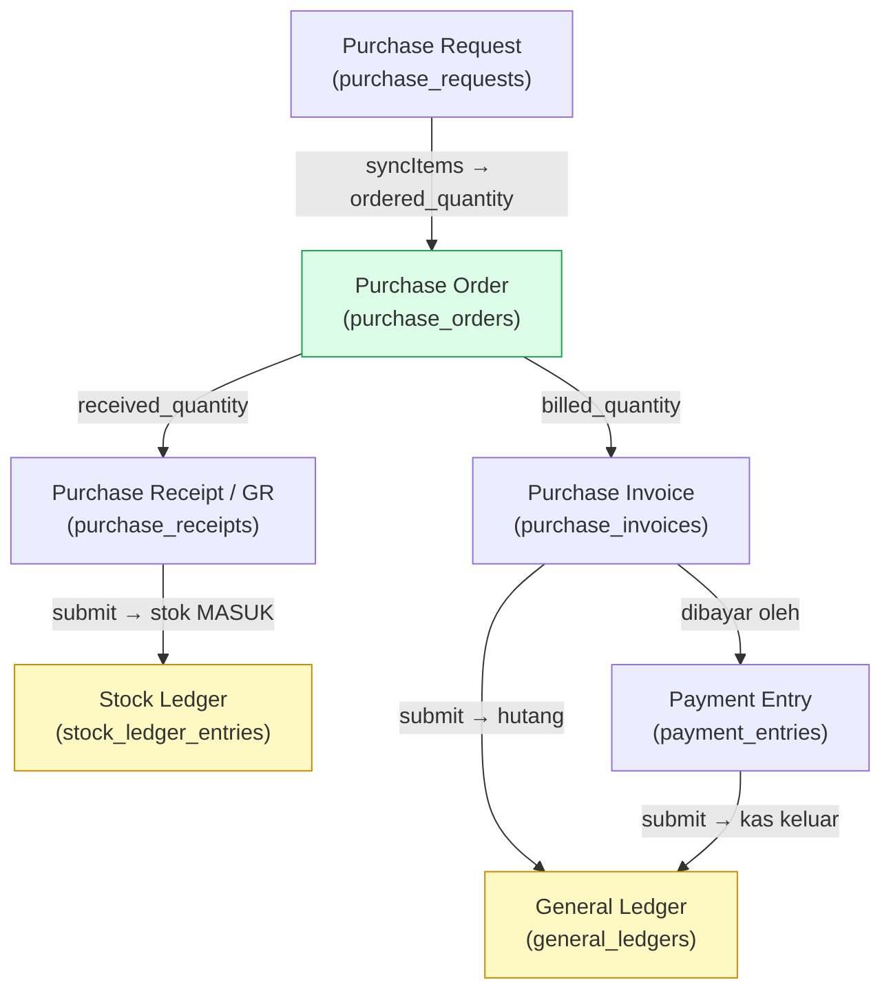
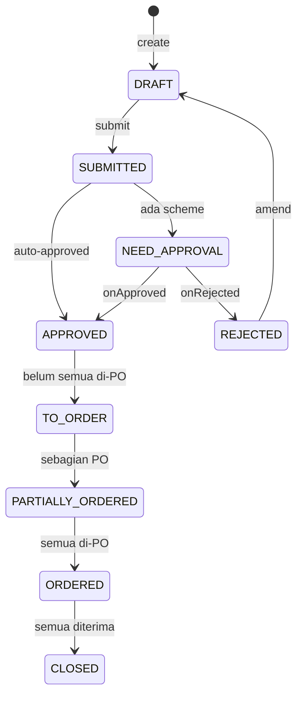
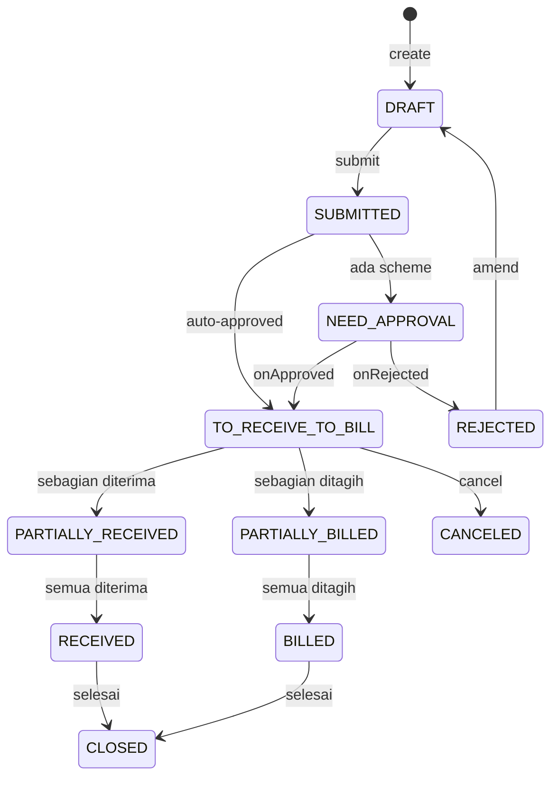
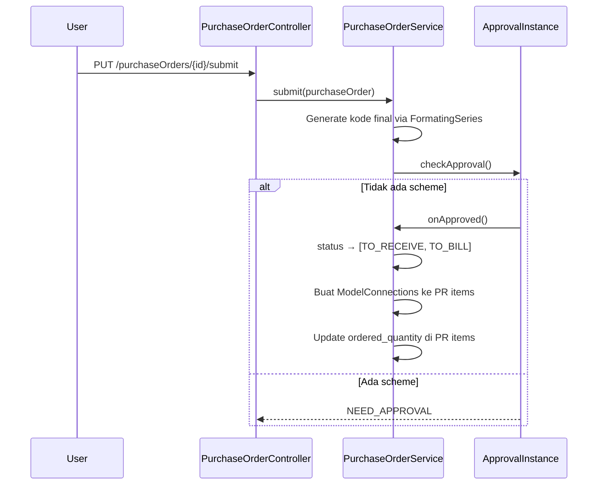
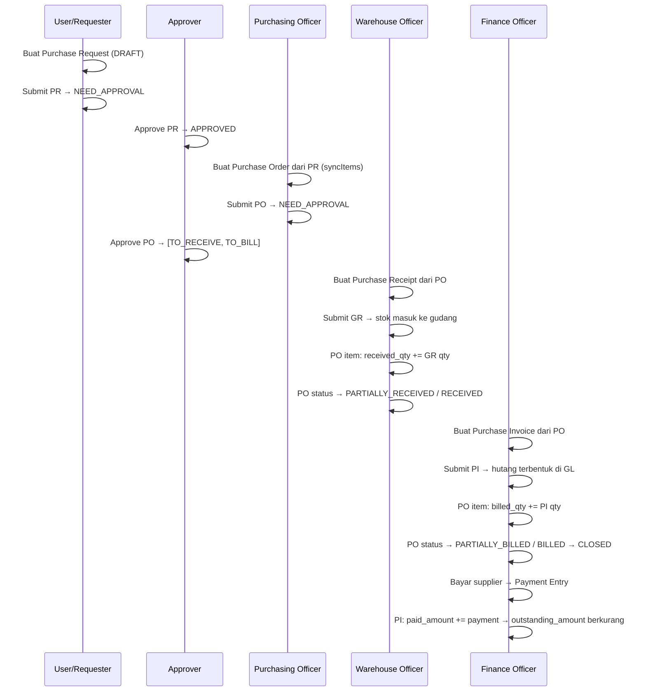
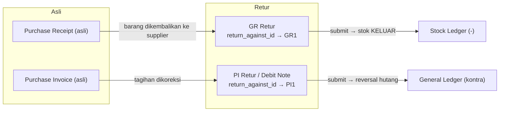

# Modul Purchase

> Dokumentasi modul pembelian: Purchase Requests, Purchase Orders, Purchase Receipts, Suppliers.

## Daftar Isi

- [Gambaran Modul](#gambaran-modul)
- [Korelasi Antar-Feature](#korelasi-antar-feature)
- [Purchase Request](#purchase-request)
- [Purchase Order](#purchase-order)
- [Purchase Receipt](#purchase-receipt)
- [Supplier](#supplier)
- [Business Flow End-to-End](#business-flow-end-to-end)
- [Flow Retur (returnAgainst)](#flow-retur-returnagainst)

---

## Gambaran Modul

Modul Purchase mengelola proses pengadaan barang dari permintaan pembelian hingga penerimaan barang dan pembayaran.

**Model utama:**

| Model | Tabel | Submitable |
|---|---|---|
| `PurchaseRequest` | `purchase_requests` | Ya |
| `PurchaseRequestItem` | `purchase_request_items` | — |
| `PurchaseOrder` | `purchase_orders` | Ya |
| `PurchaseOrderItem` | `purchase_order_items` | — |
| `PurchaseReceipt` | `purchase_receipts` | Ya |
| `PurchaseReceiptItem` | `purchase_receipt_items` | — |
| `Supplier` | `suppliers` | Tidak |

**Services:** `PurchaseOrderService`, `PurchaseReceiptService`, `PurchaseRequestService`

---

## Korelasi Antar-Feature

Alur pengadaan berjenjang: **PR → PO → Purchase Receipt (GR) → Purchase Invoice (PI) → Payment**. Tiap dokumen menunjuk ke induknya via polymorphic `referenceable` + [`model_connections`](../database.md#model_connections).

| Dari | Ke | Kolom penghubung | Efek saat submit dokumen tujuan |
|---|---|---|---|
| PR | PO | `purchaseOrders.syncItems`; `ordered_quantity` di PR item | PR → `PARTIALLY_ORDERED`/`ORDERED` |
| PO | GR | `purchase_receipt_items.purchase_order_item_id`; `received_quantity` di PO item | Stok masuk (`StockLedgerEntry`), PO → `PARTIALLY_RECEIVED`/`RECEIVED` |
| PO | PI | `purchase_invoices.purchase_order_id`; `billed_quantity` di PO item | Hutang di GL, PO → `PARTIALLY_BILLED`/`BILLED` |
| PI | Payment Entry | `payment_entries.paymentable_*` → PI (`payment_type: pay`) | `paid_amount` PI naik, kas keluar di GL |

> Korelasi sisi Sales yang setara (cermin): [Sales · Korelasi](sales.md#korelasi-antar-feature).

---

## Purchase Request

Purchase Request (PR) adalah dokumen permintaan pembelian internal yang dibuat sebelum PO.

### Fields Utama

| Field | Tipe | Deskripsi |
|---|---|---|
| `code` | string | Kode PR (FormatingSeries) |
| `date` | datetime | Tanggal PR |
| `required_date` | datetime | Tanggal dibutuhkan |
| `external_note` | text | Catatan |
| `items` | hasMany | Line items |
| `status` | json | Status aktif |

### PR Item Fields

| Field | Tipe | Deskripsi |
|---|---|---|
| `item_variant_id` | FK | Item yang diminta |
| `item_unit_id` | FK | Satuan |
| `quantity` | double | Jumlah diminta |
| `ordered_quantity` | double | Sudah di-order di PO |
| `unordered_quantity` | double | Belum di-order |
| `required_date` | datetime | Tanggal dibutuhkan per item |

### Status Workflow PR

### Routes PR (submitable)

`Purchase\PurchaseRequestController`, prefix `/purchaseRequests`. 12 route dasar + 6 submitable:

| Method | URI | Route Name | Controller@method |
|---|---|---|---|
| GET | `/purchaseRequests` | `purchaseRequests.index` | `PurchaseRequestController@index` |
| POST | `/purchaseRequests` | `purchaseRequests.store` | `PurchaseRequestController@store` |
| GET | `/purchaseRequests/create/{ref?}` | `purchaseRequests.create` | `PurchaseRequestController@create` |
| GET | `/purchaseRequests/create-print-template` | `purchaseRequests.createPrintTemplate` | `PurchaseRequestController@createPrintTemplate` |
| GET | `/purchaseRequests/{purchaseRequest}` | `purchaseRequests.show` | `PurchaseRequestController@show` |
| PUT | `/purchaseRequests/{purchaseRequest}/{level?}` | `purchaseRequests.update` | `PurchaseRequestController@update` |
| DELETE | `/purchaseRequests/{purchaseRequest}` | `purchaseRequests.destroy` | `PurchaseRequestController@destroy` |
| PUT | `/purchaseRequests/{purchaseRequest}/submit` | `purchaseRequests.submit` | `PurchaseRequestController@submit` |
| PUT | `/purchaseRequests/{purchaseRequest}/cancel` | `purchaseRequests.cancel` | `PurchaseRequestController@cancel` |
| PUT | `/purchaseRequests/{purchaseRequest}/amend` | `purchaseRequests.amend` | `PurchaseRequestController@amend` |
| GET | `/purchaseRequests/{purchaseRequest}/print/{printTemplate?}` | `purchaseRequests.print` | `PurchaseRequestController@print` |
| POST/DELETE | `/purchaseRequests/{purchaseRequest}/comment[/{id}]` | `purchaseRequests.addComment` / `removeComment` | `@addComment` / `@removeComment` |
| POST/DELETE | `/purchaseRequests/{purchaseRequest}/tag[/{id}]` | `purchaseRequests.addTag` / `removeTag` | `@addTag` / `@removeTag` |
| POST/DELETE | `/purchaseRequests/{purchaseRequest}/file[/{id}]` | `purchaseRequests.addFile` / `removeFile` | `@addFile` / `@removeFile` |

---

## Purchase Order

Purchase Order (PO) adalah dokumen pemesanan resmi yang dikirim ke supplier.

### Fields Utama

| Field | Tipe | Deskripsi |
|---|---|---|
| `code` | string | Kode PO (FormatingSeries) |
| `supplier` | relation | Supplier |
| `date` | datetime | Tanggal PO |
| `required_date` | datetime | Tanggal pengiriman yang diharapkan |
| `currency` | relation | Mata uang |
| `exchange_rate` | double | Kurs |
| `discount_on` / `discount_rate` | — | Diskon |
| `amount` | double | Total PO |
| `items` | hasMany | Line items |
| `status` | json | Status aktif |

### Default Format Kode

`@[branch_code]/PO-@[iiii]/@[yy]` → contoh: `HO/PO-0001/25`

### PO Item Fields

| Field | Tipe | Deskripsi |
|---|---|---|
| `item_id` | FK | → tabel **`item_variants`** ([Item & Variant](#catatan-item--variant)), bukan `items` |
| `item_unit_id` | FK | Satuan (`ItemUnit`) |
| `target_warehouse_id` | FK | Gudang tujuan |
| `quantity` | double | Jumlah dipesan |
| `received_quantity` | double | Sudah diterima |
| `unreceived_quantity` | double | Belum diterima |
| `billed_quantity` | double | Sudah ditagih |
| `rate` | double | Harga satuan |
| `referenceable_type/id` | polymorphic | Link ke PR item (via `model_connections`) |

> #### Catatan: Item & Variant
> `PurchaseOrderItem::item()` = `belongsTo(ItemVariant::class, 'item_id')`. Sama seperti SO, baris PO/GR me-reference **ItemVariant** (SKU), bukan Item master. UI memakai [`ItemVariantLinkModel`](../frontend.md#peta-linkmodel-relasi-ui). Detail: [Database · Item & ItemVariant](../database.md#item--itemvariant) · [Inventory](inventory.md#item--variant).

### Status Workflow PO

### Submit Flow PO

### onApproved PO

1. Status → `[TO_RECEIVE, TO_BILL]`
2. Buat `ModelConnection` dari PO items ke PR items yang dilink
3. Update `ordered_quantity` di PR items via `ModelConnection::getReferenceAttributes()`

### syncItems (dari Purchase Request)

`POST /purchaseOrders/{id}/sync-items` — auto-populate PO items dari PR yang belum di-order penuh.

### markDone

`POST /purchaseOrders/{id}/mark-done` — tandai PO selesai secara manual (bypass receipt requirement).

### Routes PO (submitable)

`Purchase\PurchaseOrderController`, prefix `/purchaseOrders`. 12 route dasar + 6 submitable + 2 non-standar:

| Method | URI | Route Name | Controller@method |
|---|---|---|---|
| GET | `/purchaseOrders` | `purchaseOrders.index` | `PurchaseOrderController@index` |
| POST | `/purchaseOrders` | `purchaseOrders.store` | `PurchaseOrderController@store` |
| GET | `/purchaseOrders/create/{ref?}` | `purchaseOrders.create` | `PurchaseOrderController@create` |
| GET | `/purchaseOrders/create-print-template` | `purchaseOrders.createPrintTemplate` | `PurchaseOrderController@createPrintTemplate` |
| GET | `/purchaseOrders/{purchaseOrder}` | `purchaseOrders.show` | `PurchaseOrderController@show` |
| PUT | `/purchaseOrders/{purchaseOrder}/{level?}` | `purchaseOrders.update` | `PurchaseOrderController@update` |
| DELETE | `/purchaseOrders/{purchaseOrder}` | `purchaseOrders.destroy` | `PurchaseOrderController@destroy` |
| PUT | `/purchaseOrders/{purchaseOrder}/submit` | `purchaseOrders.submit` | `PurchaseOrderController@submit` |
| PUT | `/purchaseOrders/{purchaseOrder}/cancel` | `purchaseOrders.cancel` | `PurchaseOrderController@cancel` |
| PUT | `/purchaseOrders/{purchaseOrder}/amend` | `purchaseOrders.amend` | `PurchaseOrderController@amend` |
| GET | `/purchaseOrders/{purchaseOrder}/print/{printTemplate?}` | `purchaseOrders.print` | `PurchaseOrderController@print` |
| POST | `/purchaseOrders/{purchaseOrder}/sync-items` | `purchaseOrders.syncItems` | `PurchaseOrderController@syncItems` |
| POST | `/purchaseOrders/{purchaseOrder}/mark-done` | `purchaseOrders.markDone` | `PurchaseOrderController@markDone` |
| POST/DELETE | `/purchaseOrders/{purchaseOrder}/comment[/{id}]` | `purchaseOrders.addComment` / `removeComment` | `@addComment` / `@removeComment` |
| POST/DELETE | `/purchaseOrders/{purchaseOrder}/tag[/{id}]` | `purchaseOrders.addTag` / `removeTag` | `@addTag` / `@removeTag` |
| POST/DELETE | `/purchaseOrders/{purchaseOrder}/file[/{id}]` | `purchaseOrders.addFile` / `removeFile` | `@addFile` / `@removeFile` |

---

## Purchase Receipt

Purchase Receipt (GR/Goods Receipt) adalah dokumen penerimaan barang dari supplier.

### Fields Utama

| Field | Tipe | Deskripsi |
|---|---|---|
| `code` | string | Kode GR (FormatingSeries) |
| `purchase_order` | relation | PO yang diterima |
| `supplier` | relation | Supplier |
| `date` | datetime | Tanggal penerimaan |
| `items` | hasMany | Barang yang diterima |
| `return_against` | relation | GR yang di-return (jika return) |

### GR Item Fields

| Field | Tipe | Deskripsi |
|---|---|---|
| `purchase_order_item_id` | FK | Link ke PO item |
| `item_id` | FK | Item |
| `target_warehouse_id` | FK | Gudang tujuan |
| `quantity` | double | Jumlah diterima |
| `returned_quantity` | double | Sudah dikembalikan |

### Submit Flow GR

Saat GR di-submit:
1. Stok masuk ke `target_warehouse` via `StockLedgerEntry`
2. PO item `received_quantity` di-update
3. PO status di-update (PARTIALLY_RECEIVED / RECEIVED)
4. Jika GR adalah return — stok berkurang, `returned_quantity` di-update

### Routes GR (submitable)

`Purchase\PurchaseReceiptController`, prefix `/purchaseReceipts`. 12 route dasar + 6 submitable:

| Method | URI | Route Name | Controller@method |
|---|---|---|---|
| GET | `/purchaseReceipts` | `purchaseReceipts.index` | `PurchaseReceiptController@index` |
| POST | `/purchaseReceipts` | `purchaseReceipts.store` | `PurchaseReceiptController@store` |
| GET | `/purchaseReceipts/create/{ref?}` | `purchaseReceipts.create` | `PurchaseReceiptController@create` |
| GET | `/purchaseReceipts/create-print-template` | `purchaseReceipts.createPrintTemplate` | `PurchaseReceiptController@createPrintTemplate` |
| GET | `/purchaseReceipts/{purchaseReceipt}` | `purchaseReceipts.show` | `PurchaseReceiptController@show` |
| PUT | `/purchaseReceipts/{purchaseReceipt}/{level?}` | `purchaseReceipts.update` | `PurchaseReceiptController@update` |
| DELETE | `/purchaseReceipts/{purchaseReceipt}` | `purchaseReceipts.destroy` | `PurchaseReceiptController@destroy` |
| PUT | `/purchaseReceipts/{purchaseReceipt}/submit` | `purchaseReceipts.submit` | `PurchaseReceiptController@submit` |
| PUT | `/purchaseReceipts/{purchaseReceipt}/cancel` | `purchaseReceipts.cancel` | `PurchaseReceiptController@cancel` |
| PUT | `/purchaseReceipts/{purchaseReceipt}/amend` | `purchaseReceipts.amend` | `PurchaseReceiptController@amend` |
| GET | `/purchaseReceipts/{purchaseReceipt}/print/{printTemplate?}` | `purchaseReceipts.print` | `PurchaseReceiptController@print` |
| POST/DELETE | `/purchaseReceipts/{purchaseReceipt}/comment[/{id}]` | `purchaseReceipts.addComment` / `removeComment` | `@addComment` / `@removeComment` |
| POST/DELETE | `/purchaseReceipts/{purchaseReceipt}/tag[/{id}]` | `purchaseReceipts.addTag` / `removeTag` | `@addTag` / `@removeTag` |
| POST/DELETE | `/purchaseReceipts/{purchaseReceipt}/file[/{id}]` | `purchaseReceipts.addFile` / `removeFile` | `@addFile` / `@removeFile` |

---

## Supplier

Master data supplier. Mendukung hierarki parent-child (TreeView trait).

### Fields

| Field | Tipe | Deskripsi |
|---|---|---|
| `name` | string | Nama supplier |
| `phone`, `email` | string | Kontak |
| `banks` | json | Informasi rekening bank |
| `street`, `city`, `province`, `zip_code` | string | Alamat |
| `country` | relation | Negara |
| `is_disabled` | boolean | Status aktif |
| `parent_id`, `lft`, `rgt`, `depth` | — | Hierarki (TreeView) |

### Routes Supplier

`Purchase\SupplierController`, prefix `/suppliers`. 12 route dasar [macro](../routes.md#konvensi-macro-routeresourcedetail):

| Method | URI | Route Name | Controller@method |
|---|---|---|---|
| GET | `/suppliers` | `suppliers.index` | `SupplierController@index` |
| POST | `/suppliers` | `suppliers.store` | `SupplierController@store` |
| GET | `/suppliers/create/{ref?}` | `suppliers.create` | `SupplierController@create` |
| GET | `/suppliers/{supplier}` | `suppliers.show` | `SupplierController@show` |
| PUT | `/suppliers/{supplier}` | `suppliers.update` | `SupplierController@update` |
| DELETE | `/suppliers/{supplier}` | `suppliers.destroy` | `SupplierController@destroy` |
| POST/DELETE | `/suppliers/{supplier}/comment[/{id}]` | `suppliers.addComment` / `removeComment` | `@addComment` / `@removeComment` |
| POST/DELETE | `/suppliers/{supplier}/tag[/{id}]` | `suppliers.addTag` / `removeTag` | `@addTag` / `@removeTag` |
| POST/DELETE | `/suppliers/{supplier}/file[/{id}]` | `suppliers.addFile` / `removeFile` | `@addFile` / `@removeFile` |

---

## Business Flow End-to-End

### Flow Pengadaan Standar

---

## Flow Retur (returnAgainst)

Retur pembelian = dokumen **Purchase Receipt** atau **Purchase Invoice** baru yang menunjuk ke dokumen asli via `return_against_id` (+ `return_against_item_id` per baris).

| Dokumen | Penanda retur | Efek submit retur |
|---|---|---|
| **Purchase Receipt** | `purchase_receipts.return_against_id` → GR asli; item `return_against_item_id` | Stok **keluar** dari gudang (barang dikembalikan ke supplier); `returned_quantity` di GR asli bertambah; PO di-recalculate |
| **Purchase Invoice** | `purchase_invoices.return_against_id` → PI asli | GL kontra (kurangi hutang/persediaan); `billed_quantity` PO disesuaikan |

- `PurchaseReceipt::returnAgainst()` / `PurchaseInvoice::returnAgainst()` = self-FK `belongsTo`.
- Sisi Sales setara: DN retur & SI retur — lihat [Sales · Flow Retur](sales.md#flow-retur-returnagainst).

---

## Frontend Pages

| Entitas | File |
|---|---|
| Purchase Request | `Pages/Purchase/PurchaseRequests/Index.jsx`, `Show.jsx`, `ItemForm.jsx` |
| Purchase Order | `Pages/Purchase/PurchaseOrders/Index.jsx`, `ItemForm.jsx`, `PurchaseOrderLinkModel.jsx` |
| Purchase Receipt | `Pages/Purchase/PurchaseReceipts/Index.jsx`, `Show.jsx`, `ItemForm.jsx`, `PurchaseReceiptLinkModel.jsx` |
| Supplier | `Pages/Purchase/Suppliers/Index.jsx`, `Form.jsx`, `SupplierLinkModel.jsx` |

Lihat [Frontend · Purchase](../frontend.md#purchase) dan [Peta LinkModel](../frontend.md#peta-linkmodel-relasi-ui).

---

## Related Documents

| Topik | Dokumen |
|---|---|
| Item line → ItemVariant | [Inventory · Item & Variant](inventory.md#item--variant) · [Database](../database.md#item--itemvariant) |
| Penerimaan barang ke gudang | [Inventory · Stock & Ledger](inventory.md) |
| Tagihan dari supplier | [Finances · Purchase Invoice](finances.md) |
| Pembayaran ke supplier | [Finances · Payment Entry](finances.md) |
| Sistem approval | [Core · Approval](core.md#approval) · [Auth · Workflow](../auth.md#workflow-dokumen) |
| Tautan antar dokumen (`model_connections`) | [Core · ModelConnection](core.md) · [Database](../database.md#model_connections) |
| Tabel database | [Database · Domain Purchase](../database.md#domain-purchase) |
| Daftar route + Controller@method | [Routes · Purchase](../routes.md#11-purchase) |
| Halaman React | [Frontend · Purchase](../frontend.md#purchase) |
