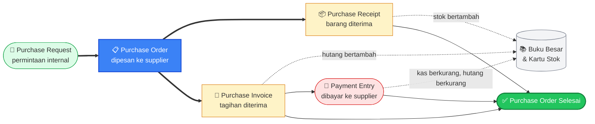
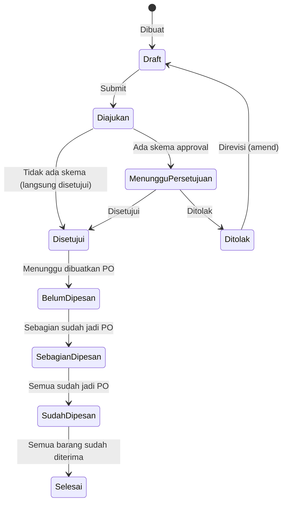
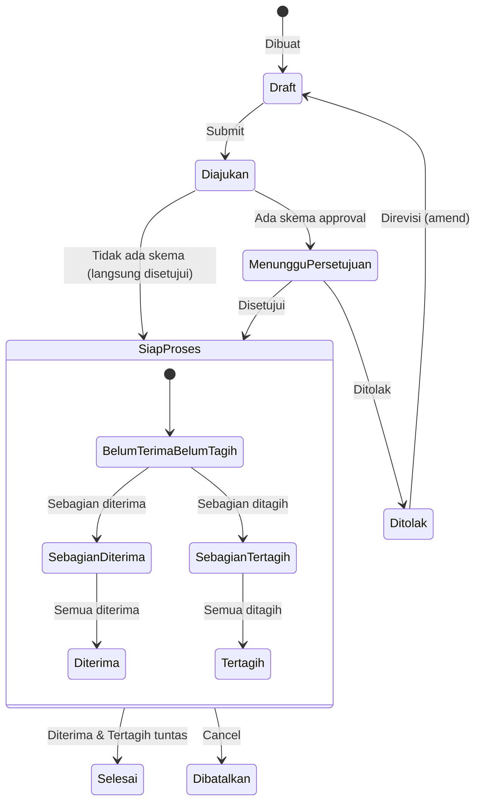
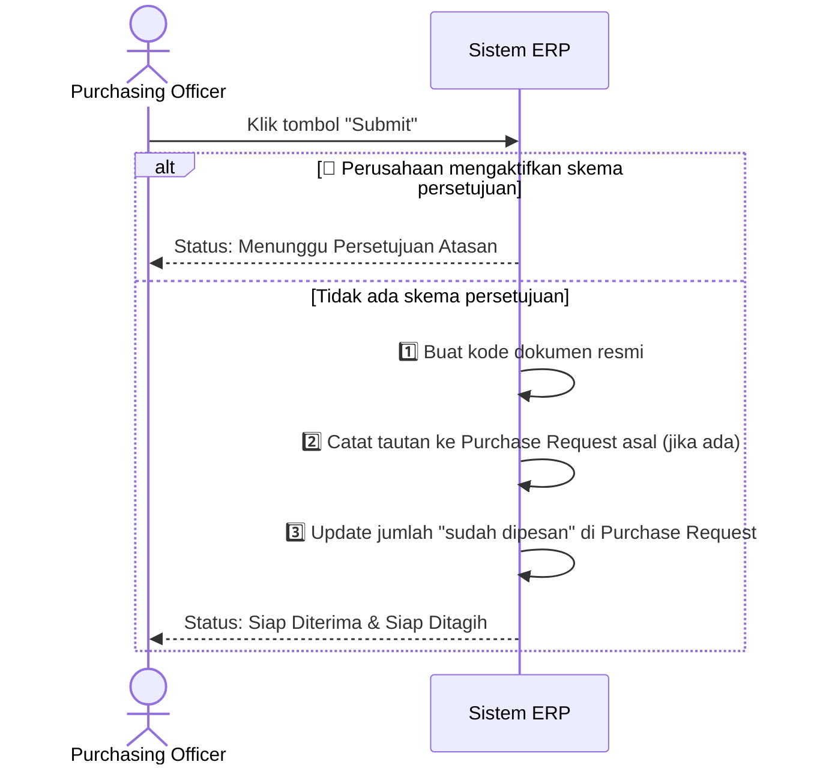
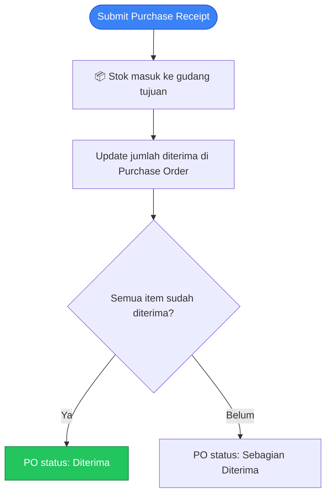
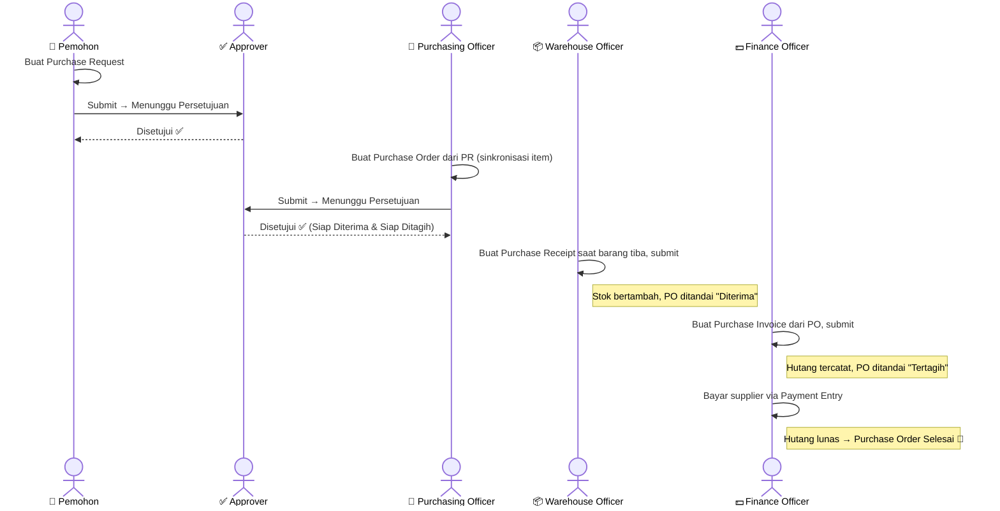
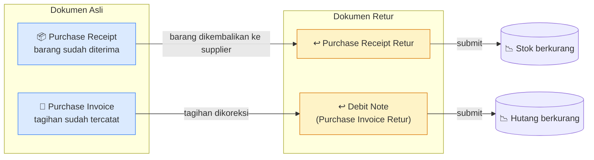

# Modul Purchase

> Dokumentasi modul pembelian: Purchase Requests, Purchase Orders, Purchase Receipts, Suppliers.

## Daftar Isi

- [Gambaran Modul](#gambaran-modul)
- [Korelasi Antar-Feature](#korelasi-antar-feature)
- [Purchase Request](#purchase-request)
- [Purchase Order](#purchase-order)
- [Purchase Receipt](#purchase-receipt)
- [Supplier](#supplier)
- [Business Flow End-to-End](#business-flow-end-to-end)
- [Flow Retur (returnAgainst)](#flow-retur-returnagainst)

---

## Gambaran Modul

Modul Purchase mengelola proses pengadaan barang dari permintaan pembelian hingga penerimaan barang dan pembayaran ke supplier.

**Dokumen utama yang terlibat:**

| Dokumen | Fungsi |
|---|---|
| Purchase Request | Permintaan pembelian internal (opsional, sebelum PO dibuat) |
| Purchase Order | Pesanan resmi yang dikirim ke supplier |
| Purchase Receipt | Bukti penerimaan barang dari supplier |
| Supplier | Data pemasok/vendor |

---

## Korelasi Antar-Feature

Alur pengadaan berjenjang: **Purchase Request → Purchase Order → Purchase Receipt → Purchase Invoice → Pembayaran**.

**Cara membaca diagram ini:**
- Panah tebal (`==>`) = **alur utama** dokumen. Purchase Request bersifat opsional — Purchase Order bisa langsung dibuat tanpa PR.
- Panah putus-putus = **efek otomatis** ke pembukuan/stok setiap dokumen di-submit.
- Purchase Order dianggap **Selesai** setelah seluruh barang diterima, seluruh tagihan terbit, dan sudah dibayar lunas.

> Alur setara di sisi penjualan: [Sales · Korelasi](sales.md#korelasi-antar-feature).

---

## Purchase Request

Purchase Request (PR) adalah permintaan pembelian internal yang dibuat sebelum Purchase Order — biasanya dipakai untuk meminta persetujuan anggaran/kebutuhan sebelum benar-benar memesan ke supplier.

### Fields Utama

| Field | Deskripsi |
|---|---|
| Kode | Kode PR (dibuat otomatis) |
| Tanggal | Tanggal PR dibuat |
| Tanggal Dibutuhkan | Kapan barang ini dibutuhkan |
| Catatan | Catatan tambahan |
| Baris Item | Daftar item yang diminta |

### Baris Item PR

| Field | Deskripsi |
|---|---|
| Item (Variant) | Barang yang diminta |
| Satuan | Satuan pengukuran |
| Jumlah Diminta | Total jumlah yang diminta |
| Sudah Dipesan | Jumlah yang sudah masuk ke Purchase Order |
| Belum Dipesan | Sisa jumlah yang belum dipesan |
| Tanggal Dibutuhkan (per baris) | Bisa berbeda per item |

### Alur Status PR

---

## Purchase Order

Purchase Order (PO) adalah dokumen pemesanan resmi yang dikirim ke supplier.

### Fields Utama

| Field | Deskripsi |
|---|---|
| Kode | Kode PO (dibuat otomatis, contoh format: `HO/PO-0001/25`) |
| Supplier | Pemasok tujuan pemesanan |
| Tanggal | Tanggal PO dibuat |
| Tanggal Dibutuhkan | Perkiraan tanggal barang harus tiba |
| Mata Uang & Kurs | Untuk pembelian dalam mata uang asing |
| Diskon | Diskon total PO |
| Total | Total nilai PO |
| Baris Item | Daftar barang yang dipesan |

### Baris Item PO

| Field | Deskripsi |
|---|---|
| Item (Variant) | Barang yang dipesan — memilih Variant, bukan Item master langsung |
| Satuan | Satuan pengukuran |
| Gudang Tujuan | Gudang tempat barang akan disimpan |
| Jumlah Dipesan | Total jumlah pesanan |
| Sudah Diterima / Belum Diterima | Progres penerimaan barang |
| Sudah Ditagih | Progres penagihan dari supplier |
| Harga Satuan | Harga per unit |

> Baris PO memilih **Variant** dari item (SKU konkret), bukan Item master secara langsung — sama seperti pola di Sales Order.

### Alur Status PO

> **Catatan:** Penerimaan barang dan penagihan berjalan **independen** — satu Purchase Order bisa "sudah diterima tapi belum ditagih", atau sebaliknya, sampai keduanya benar-benar tuntas.

### Apa yang Terjadi Saat Anda Klik "Submit"

### Fitur Pendukung

- **Sinkronisasi item dari Purchase Request** — tombol "Sync dari PR" otomatis mengisi baris item PO dari Purchase Request yang belum sepenuhnya dipesan, supaya tidak perlu input ulang manual.
- **Tandai Selesai** — tombol untuk menutup PO secara manual, berguna kalau barang tidak akan diterima secara penuh (mis. supplier tidak bisa memenuhi seluruh pesanan).

---

## Purchase Receipt

Purchase Receipt (sering disebut GR / Goods Receipt) adalah dokumen bukti penerimaan barang dari supplier.

### Fields Utama

| Field | Deskripsi |
|---|---|
| Kode | Kode dokumen (dibuat otomatis) |
| Purchase Order | PO yang diterima barangnya |
| Supplier | Pemasok |
| Tanggal Penerimaan | Kapan barang diterima |
| Baris Item | Barang yang diterima |

### Baris Item Purchase Receipt

| Field | Deskripsi |
|---|---|
| Baris PO Terkait | Baris Purchase Order asal |
| Item | Barang yang diterima |
| Gudang Tujuan | Gudang tempat barang disimpan |
| Jumlah Diterima | Jumlah barang yang diterima |
| Jumlah Dikembalikan | Terisi jika ini dokumen retur |

### Apa yang Terjadi Saat Purchase Receipt Disubmit

> Jika dokumen ini adalah **retur** (barang dikembalikan ke supplier), arah stoknya terbalik — lihat [Flow Retur](#flow-retur-returnagainst).

---

## Supplier

Master data supplier/pemasok. Bisa disusun berjenjang (parent-child) untuk mengelompokkan supplier.

### Fields

| Field | Deskripsi |
|---|---|
| Nama | Nama supplier |
| Telepon, Email | Kontak |
| Rekening Bank | Informasi rekening untuk pembayaran |
| Alamat | Jalan, kota, provinsi, kode pos |
| Negara | Negara asal supplier |
| Status Aktif | Apakah supplier masih aktif dipakai |

---

## Business Flow End-to-End

Kolaborasi antar peran dalam satu siklus pengadaan penuh — dari permintaan sampai pembayaran:

---

## Flow Retur (returnAgainst)

Retur pembelian **bukan** dokumen jenis baru — cukup buat Purchase Receipt atau Purchase Invoice seperti biasa, tapi tandai sebagai "retur dari" dokumen aslinya.

### Ringkasan Efeknya

| Dokumen Retur | Efek Saat Disubmit |
|---|---|
| **Purchase Receipt Retur** | Stok **keluar kembali** (dikembalikan ke supplier); jumlah "dikembalikan" pada Purchase Receipt asli bertambah; status Purchase Order ikut disesuaikan |
| **Debit Note (Purchase Invoice Retur)** | Hutang & persediaan **dikoreksi berkurang**; jumlah tertagih pada Purchase Order disesuaikan |

- Purchase Receipt Retur dan Debit Note masing-masing selalu tertaut ke dokumen aslinya.
- Sisi Sales setara: DN retur & Credit Note — lihat [Sales · Flow Retur](sales.md#flow-retur-returnagainst).

---

## Related Documents

| Topik | Dokumen |
|---|---|
| Item line → ItemVariant | [Inventory · Item & Variant](inventory.md#item--variant) |
| Penerimaan barang ke gudang | [Inventory · Stock & Ledger](inventory.md) |
| Tagihan dari supplier | [Finances · Purchase Invoice](finances.md) |
| Pembayaran ke supplier | [Finances · Payment Entry](finances.md) |
| Sistem approval | [Core · Approval](core.md#approval) |
