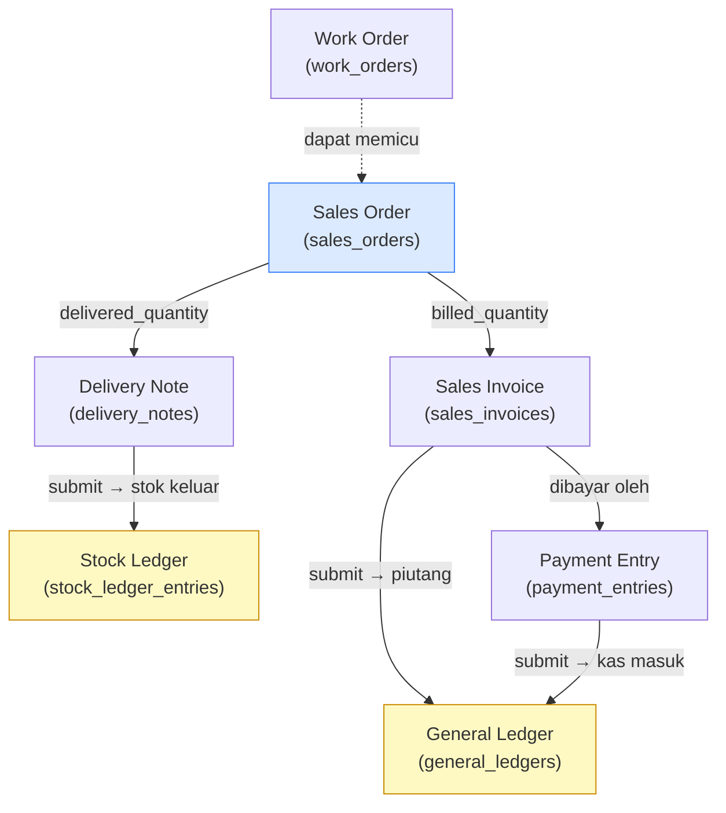
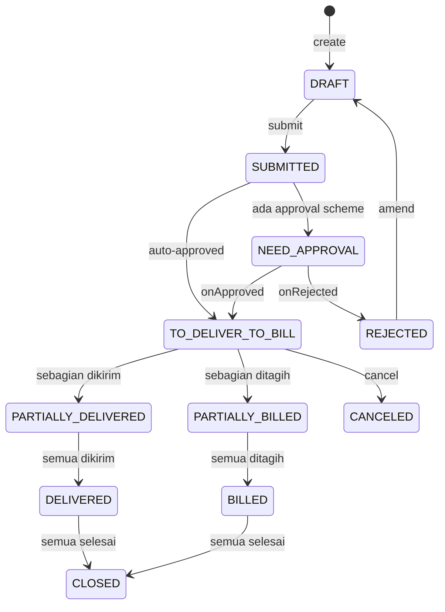
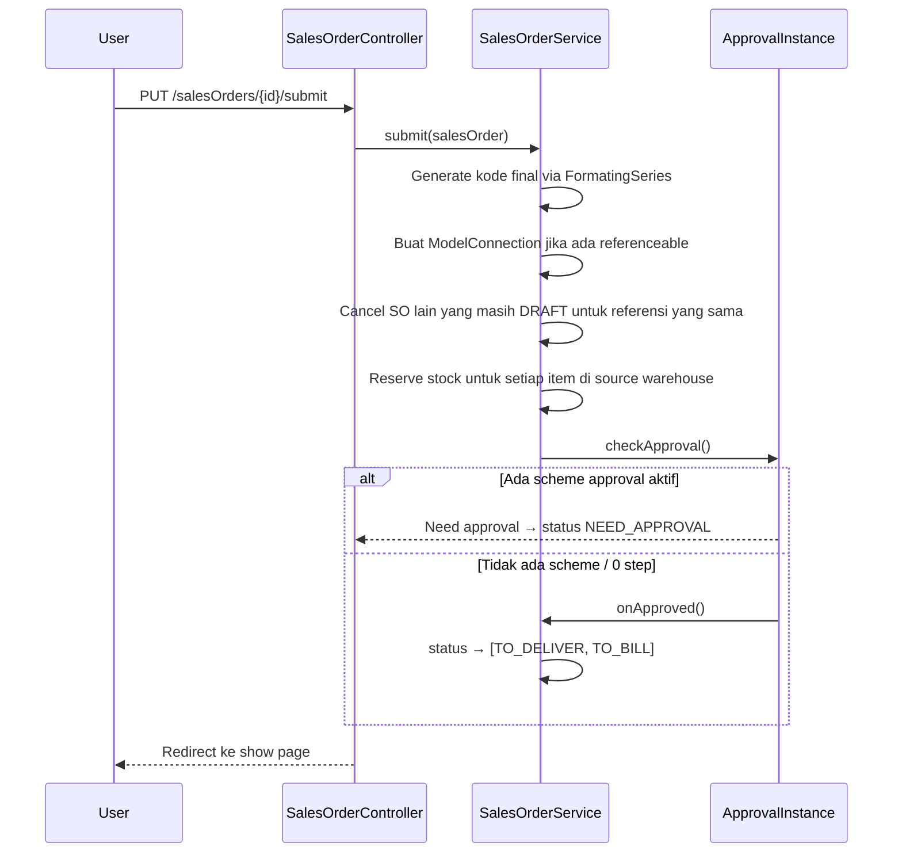
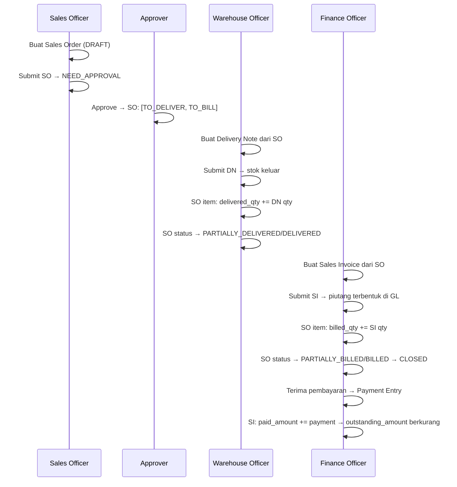
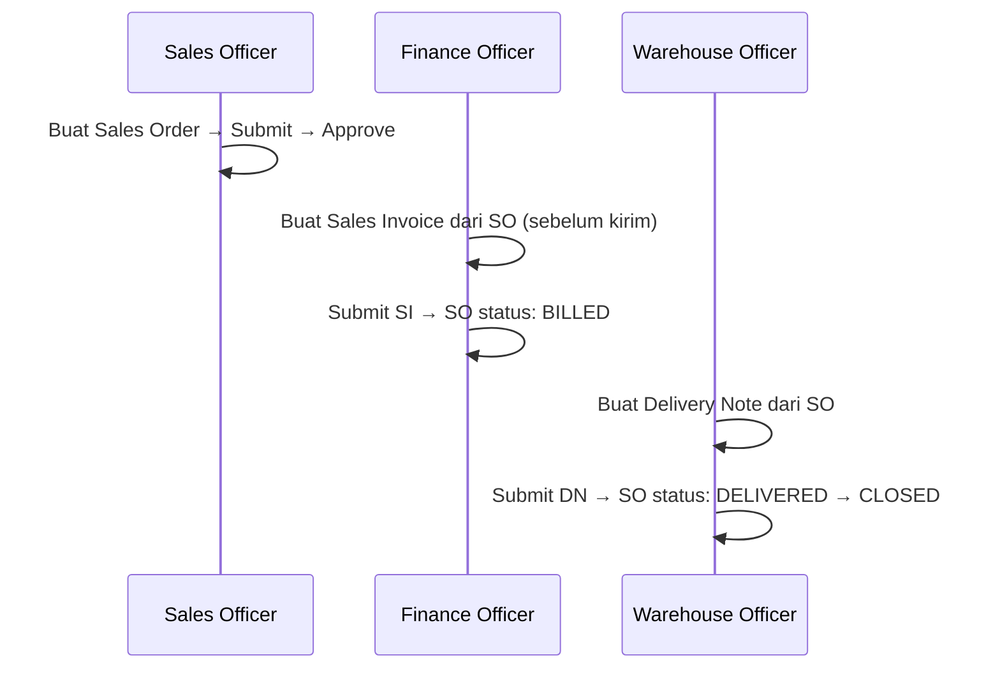
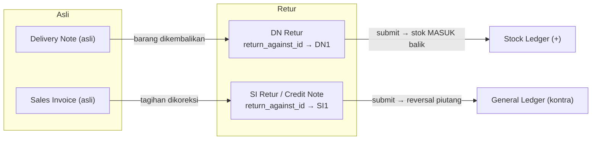

# Modul Sales

> Dokumentasi modul penjualan: Sales Orders, Internal Orders, Customers.

## Daftar Isi

- [Gambaran Modul](#gambaran-modul)
- [Korelasi Antar-Feature](#korelasi-antar-feature)
- [Sales Order](#sales-order)
- [Item & Variant](#item--variant)
- [Internal Order](#internal-order)
- [Customer](#customer)
- [Status Workflow](#status-workflow)
- [Business Flow End-to-End](#business-flow-end-to-end)
- [Flow Retur (returnAgainst)](#flow-retur-returnagainst)

---

## Gambaran Modul

Modul Sales mengelola proses penjualan dari pembuatan order hingga pengiriman dan penagihan.

**Model utama:**

| Model | Tabel | Submitable |
|---|---|---|
| `SalesOrder` | `sales_orders` | Ya |
| `SalesOrderItem` | `sales_order_items` | — |
| `InternalOrder` | `internal_orders` | Ya |
| `InternalOrderItem` | `internal_order_items` | — |
| `Customer` | `customers` | Tidak |

**Services:** `SalesOrderService`, `InternalOrderService`, `CustomerService`

**Permissions:**

| Role | SO Actions | IO Actions |
|---|---|---|
| Sales Officer | select, read, write, create, delete, submit, cancel, amend, print | select, read, write, create, delete, submit, cancel, amend, print |
| Approver | select, read, submit, cancel, amend, print | select, read, submit, cancel, amend, print |
| Auditor | select, read, print | select, read, print |
| System Manager | Semua | Semua |

---

## Korelasi Antar-Feature

Sales Order adalah **hub** yang men-spawn dokumen turunan. Setiap turunan menunjuk kembali ke SO via relasi polymorphic `referenceable` (dicatat di [`model_connections`](../database.md#model_connections)).



| Dari | Ke | Kolom penghubung | Efek saat submit dokumen tujuan |
|---|---|---|---|
| SO | DN | `delivery_notes.referenceable_*` → SO; `delivered_quantity` di SO item | Stok keluar (`StockLedgerEntry`), SO → `PARTIALLY_DELIVERED`/`DELIVERED` |
| SO | SI | `sales_invoices.sales_order_id`; `billed_quantity` di SO item | Piutang di GL, SO → `PARTIALLY_BILLED`/`BILLED` |
| SI | Payment Entry | `payment_entries.paymentable_*` → SI | `paid_amount` SI naik, `outstanding_amount` turun, kas masuk di GL |
| SO | (CLOSED) | semua delivered & billed selesai | SO → `CLOSED` |

> Dua urutan valid — lihat [Dual Flow](#dual-flow-so--dn--si-atau-so--si--dn). Korelasi sisi Purchase yang setara: [Purchase · Korelasi](purchase.md#korelasi-antar-feature).

---

## Sales Order

Sales Order (SO) adalah dokumen utama proses penjualan ke customer.

### Fields Utama

| Field | Tipe | Deskripsi |
|---|---|---|
| `code` | string | Kode SO (auto: FormatingSeries) |
| `customer` | relation | Customer pemesan |
| `customer_branch` | relation | Cabang customer |
| `date` | datetime | Tanggal SO |
| `is_rent` | boolean | Apakah transaksi rental |
| `start_date` / `end_date` | datetime | Periode rental (jika is_rent) |
| `items` | hasMany | Line items (lihat [Item & Variant](#item--variant)) |
| `currency` | relation | Mata uang transaksi |
| `discount_on` | enum | `grand_total` / `net_total` |
| `discount_rate` | double | Persentase diskon |
| `amount` | double | Total SO |
| `payment_schedules` | morphMany | Jadwal pembayaran |
| `status` | json | Status aktif (multi-status) |

### Default Format Kode

`@[branch_code]/SO-@[iiii]/@[yy]` → contoh: `HO/SO-0001/25`

### Status Workflow SO



**Catatan:** Status SO adalah JSON array, bisa multi-status simultan (contoh: `["to_deliver", "to_bill"]`, `["partially_delivered", "to_bill"]`).

### Submit Flow



### onApproved

```php
$salesOrder->update(['status' => [FormStatus::TO_DELIVER, FormStatus::TO_BILL]]);
```

### onRejected / cancel

```php
$salesOrder->update(['status' => [FormStatus::REJECTED/CANCELED]]);
// Rollback: hapus stock reservations untuk semua item SO
```

### Status Auto-Update

SO status di-update otomatis setiap ada perubahan Delivery Note atau Sales Invoice terkait:
- Delivered: 0 → `TO_DELIVER`, partial → `PARTIALLY_DELIVERED`, full → `DELIVERED`
- Billed: 0 → `TO_BILL`, partial → `PARTIALLY_BILLED`, full → `BILLED`
- Jika semua delivery dan billing selesai → `CLOSED`

### Dual Flow: SO → DN → SI atau SO → SI → DN

Aplikasi mendukung dua alur penjualan:
1. **SO → Delivery Note → Sales Invoice** (kirim dulu, tagih kemudian)
2. **SO → Sales Invoice → Delivery Note** (tagih dulu, kirim kemudian)

Kedua alur valid karena SO items memiliki kolom terpisah:
- `delivered_quantity` + `undelivered_quantity`
- `billed_quantity` + `unbilled_quantity`

### Routes SO (submitable)

`Sales\SalesOrderController`, prefix `/salesOrders`. 12 route dasar + 6 submitable + 2 non-standar:

| Method | URI | Route Name | Controller@method |
|---|---|---|---|
| GET | `/salesOrders` | `salesOrders.index` | `SalesOrderController@index` |
| POST | `/salesOrders` | `salesOrders.store` | `SalesOrderController@store` |
| GET | `/salesOrders/create/{ref?}` | `salesOrders.create` | `SalesOrderController@create` |
| GET | `/salesOrders/create-print-template` | `salesOrders.createPrintTemplate` | `SalesOrderController@createPrintTemplate` |
| GET | `/salesOrders/{salesOrder}` | `salesOrders.show` | `SalesOrderController@show` |
| PUT | `/salesOrders/{salesOrder}/{level?}` | `salesOrders.update` | `SalesOrderController@update` |
| DELETE | `/salesOrders/{salesOrder}` | `salesOrders.destroy` | `SalesOrderController@destroy` |
| PUT | `/salesOrders/{salesOrder}/submit` | `salesOrders.submit` | `SalesOrderController@submit` |
| PUT | `/salesOrders/{salesOrder}/cancel` | `salesOrders.cancel` | `SalesOrderController@cancel` |
| PUT | `/salesOrders/{salesOrder}/amend` | `salesOrders.amend` | `SalesOrderController@amend` |
| GET | `/salesOrders/{salesOrder}/print/{printTemplate?}` | `salesOrders.print` | `SalesOrderController@print` |
| POST | `/salesOrders/{salesOrder}/sync-items` | `salesOrders.syncItems` | `SalesOrderController@syncItems` |
| POST | `/salesOrders/{salesOrder}/mark-done` | `salesOrders.markDone` | `SalesOrderController@markDone` |
| POST | `/salesOrders/{salesOrder}/comment` | `salesOrders.addComment` | `SalesOrderController@addComment` |
| DELETE | `/salesOrders/{salesOrder}/comment/{id}` | `salesOrders.removeComment` | `SalesOrderController@removeComment` |
| POST | `/salesOrders/{salesOrder}/tag` | `salesOrders.addTag` | `SalesOrderController@addTag` |
| DELETE | `/salesOrders/{salesOrder}/tag/{id}` | `salesOrders.removeTag` | `SalesOrderController@removeTag` |
| POST | `/salesOrders/{salesOrder}/file` | `salesOrders.addFile` | `SalesOrderController@addFile` |
| DELETE | `/salesOrders/{salesOrder}/file/{id}` | `salesOrders.removeFile` | `SalesOrderController@removeFile` |

### Frontend Pages

| File | Deskripsi |
|---|---|
| `Pages/Sales/SalesOrders/Index.jsx` | Daftar SO (DataTable2) |
| `Pages/Sales/SalesOrders/Form.jsx` | Form buat/edit SO |
| `Pages/Sales/SalesOrders/Show.jsx` | Detail SO |
| `Pages/Sales/SalesOrders/ItemForm.jsx` | Sub-form baris item (memilih [ItemVariant](#item--variant), Unit, Tax, Warehouse) |
| `Pages/Sales/SalesOrders/SalesOrderLinkModel.jsx` | Selector SO untuk dipakai dokumen lain (DN, SI) |

Lihat juga [Frontend · Sales](../frontend.md#sales) dan [Peta LinkModel](../frontend.md#peta-linkmodel-relasi-ui).

---

## Item & Variant

Baris item Sales Order (`SalesOrderItem`) **bukan** mereferensikan `Item` master, melainkan **`ItemVariant`** (SKU konkret):

```php
// app/Models/Sales/SalesOrderItem.php
public function item() {
    return $this->belongsTo(ItemVariant::class, 'item_id');
}
```

Artinya kolom `sales_order_items.item_id` → tabel **`item_variants`**. Konsekuensi:

- Di UI, kolom "Item" pada baris SO memakai komponen [`ItemVariantLinkModel`](../frontend.md#peta-linkmodel-relasi-ui).
- Reservasi stok saat submit dilakukan per-variant per-`source_warehouse`.
- Relasi tambahan per baris: `unit` → `ItemUnit`, `tax` → `Tax`, `sourceWarehouse` → `Warehouse`.

> **Tax opsional**: baris item SO kini valid tanpa memilih pajak — form tetap bisa disubmit walau kolom `tax` kosong. Jika tidak ada tax dipilih, `tax_amount`/`dpp_amount` (dihitung di sisi invoice, lihat [Finances · DPP](finances.md#si-item-fields)) bernilai 0.

> Penjelasan lengkap relasi Item ↔ ItemVariant: [Database · Item & ItemVariant](../database.md#item--itemvariant) · [Modul Inventory](inventory.md#item--variant).

---

## Internal Order

Internal Order adalah transfer order antar branch perusahaan sendiri.

Struktur serupa dengan Sales Order, namun:
- Tidak ada customer eksternal
- `status` workflow sama: DRAFT → SUBMITTED → APPROVED → TO_DELIVER → ...
- Digunakan untuk replenishment stok antar gudang/cabang

### Routes IO (submitable)

`Sales\InternalOrderController`, prefix `/internalOrders`. 12 route dasar + 6 submitable:

| Method | URI | Route Name | Controller@method |
|---|---|---|---|
| GET | `/internalOrders` | `internalOrders.index` | `InternalOrderController@index` |
| POST | `/internalOrders` | `internalOrders.store` | `InternalOrderController@store` |
| GET | `/internalOrders/create/{ref?}` | `internalOrders.create` | `InternalOrderController@create` |
| GET | `/internalOrders/create-print-template` | `internalOrders.createPrintTemplate` | `InternalOrderController@createPrintTemplate` |
| GET | `/internalOrders/{internalOrder}` | `internalOrders.show` | `InternalOrderController@show` |
| PUT | `/internalOrders/{internalOrder}/{level?}` | `internalOrders.update` | `InternalOrderController@update` |
| DELETE | `/internalOrders/{internalOrder}` | `internalOrders.destroy` | `InternalOrderController@destroy` |
| PUT | `/internalOrders/{internalOrder}/submit` | `internalOrders.submit` | `InternalOrderController@submit` |
| PUT | `/internalOrders/{internalOrder}/cancel` | `internalOrders.cancel` | `InternalOrderController@cancel` |
| PUT | `/internalOrders/{internalOrder}/amend` | `internalOrders.amend` | `InternalOrderController@amend` |
| GET | `/internalOrders/{internalOrder}/print/{printTemplate?}` | `internalOrders.print` | `InternalOrderController@print` |
| POST | `/internalOrders/{internalOrder}/comment` | `internalOrders.addComment` | `InternalOrderController@addComment` |
| DELETE | `/internalOrders/{internalOrder}/comment/{id}` | `internalOrders.removeComment` | `InternalOrderController@removeComment` |
| POST | `/internalOrders/{internalOrder}/tag` | `internalOrders.addTag` | `InternalOrderController@addTag` |
| DELETE | `/internalOrders/{internalOrder}/tag/{id}` | `internalOrders.removeTag` | `InternalOrderController@removeTag` |
| POST | `/internalOrders/{internalOrder}/file` | `internalOrders.addFile` | `InternalOrderController@addFile` |
| DELETE | `/internalOrders/{internalOrder}/file/{id}` | `internalOrders.removeFile` | `InternalOrderController@removeFile` |

---

## Customer

Master data customer. Bukan dokumen workflow — tidak punya status.

### Fields

| Field | Tipe | Deskripsi |
|---|---|---|
| `name` | string | Nama customer |
| `email` | string | Email |
| `phone` | string | Telepon |
| `vat` | string | NPWP / Tax ID |
| `is_disabled` | boolean | Status aktif |
| `street`, `city`, `province`, `zip_code` | string | Alamat |
| `country` | relation | Negara |

### Routes Customer

`Sales\CustomerController`, prefix `/customers`. 12 route dasar [macro](../routes.md#konvensi-macro-routeresourcedetail) (non-submitable):

| Method | URI | Route Name | Controller@method |
|---|---|---|---|
| GET | `/customers` | `customers.index` | `CustomerController@index` |
| POST | `/customers` | `customers.store` | `CustomerController@store` |
| GET | `/customers/create/{ref?}` | `customers.create` | `CustomerController@create` |
| GET | `/customers/{customer}` | `customers.show` | `CustomerController@show` |
| PUT | `/customers/{customer}` | `customers.update` | `CustomerController@update` |
| DELETE | `/customers/{customer}` | `customers.destroy` | `CustomerController@destroy` |
| POST/DELETE | `/customers/{customer}/comment[/{id}]` | `customers.addComment` / `removeComment` | `@addComment` / `@removeComment` |
| POST/DELETE | `/customers/{customer}/tag[/{id}]` | `customers.addTag` / `removeTag` | `@addTag` / `@removeTag` |
| POST/DELETE | `/customers/{customer}/file[/{id}]` | `customers.addFile` / `removeFile` | `@addFile` / `@removeFile` |

---

## Status Workflow

### FormStatus yang digunakan di modul Sales

| Status | Value | Deskripsi |
|---|---|---|
| DRAFT | `draft` | Baru dibuat, belum disubmit |
| SUBMITTED | `submitted` | Sudah disubmit |
| NEED_APPROVAL | `need_approval` | Menunggu persetujuan |
| APPROVED | `approved` | Disetujui |
| REJECTED | `rejected` | Ditolak (bisa di-amend) |
| CANCELED | `canceled` | Dibatalkan |
| TO_DELIVER | `to_deliver` | Menunggu pengiriman |
| PARTIALLY_DELIVERED | `partially_delivered` | Sebagian sudah dikirim |
| DELIVERED | `delivered` | Semua sudah dikirim |
| TO_BILL | `to_bill` | Menunggu penagihan |
| PARTIALLY_BILLED | `partially_billed` | Sebagian sudah ditagih |
| BILLED | `billed` | Semua sudah ditagih |
| CLOSED | `closed` | SO selesai |
| IN_RENT | `in_rent` | Sedang dalam rental |
| RETURNED | `returned` | Barang rental dikembalikan |

---

## Business Flow End-to-End

### Flow Penjualan Standar (SO → DN → SI)



### Flow Penjualan Invoice-First (SO → SI → DN)



---

## Flow Retur (returnAgainst)

Retur **bukan** dokumen jenis baru — melainkan dokumen bertipe sama (Delivery Note / Sales Invoice) yang menunjuk ke dokumen asli lewat kolom `return_against_id` (header) dan `return_against_item_id` (per baris). Quantity diisi sebagai **pengembalian** (mengurangi qty terkirim/tertagih).



### Mekanisme (sesuai kode)

| Dokumen | Penanda retur | Efek submit retur |
|---|---|---|
| **Delivery Note** | `delivery_notes.return_against_id` → DN asli; item `return_against_item_id` | Stok **masuk kembali** ke `source_warehouse`; `returned_quantity` di DN item asli bertambah; status SO di-recalculate |
| **Sales Invoice** | `sales_invoices.return_against_id` → SI asli; `is_return` (append) = `return_against_id != null` | GL kontra (kurangi piutang/pendapatan); `billed_quantity` SO disesuaikan |

- `DeliveryNote::returnAgainst()` = `belongsTo(DeliveryNote, 'return_against_id')`; per baris `DeliveryNoteItem::returnAgainstItem()`.
- `SalesInvoice::isReturn()` → `return_against_id != null`; UI menandai dokumen sebagai retur/credit note.
- Sisi Purchase setara: GR retur & PI retur — lihat [Purchase · Flow Retur](purchase.md#flow-retur-returnagainst).

> Catatan: saat dokumen retur di-**cancel**, trait [`Submitable`](core.md#trait-submitable) otomatis soft-delete entri GL & Stock Ledger terkait (reversal).

---

## Related Documents

| Topik | Dokumen |
|---|---|
| Item line → ItemVariant | [Inventory · Item & Variant](inventory.md#item--variant) · [Database](../database.md#item--itemvariant) |
| Customer | [Frontend · CustomerLinkModel](../frontend.md#peta-linkmodel-relasi-ui) |
| Pengiriman dari SO | [Inventory · Delivery Note](inventory.md) |
| Penagihan dari SO | [Finances · Sales Invoice](finances.md) |
| Pembayaran invoice | [Finances · Payment Entry](finances.md) |
| Sistem approval | [Core · Approval](core.md#approval) · [Auth · Workflow](../auth.md#workflow-dokumen) |
| Penomoran kode SO | [Core · FormatingSeries](core.md) |
| Tabel database | [Database · Domain Sales](../database.md#domain-sales) |
| Daftar route + Controller@method | [Routes · Sales](../routes.md#12-sales) |
| Halaman React | [Frontend · Sales](../frontend.md#sales) |
| Asal SO dari Quotation (CRM) | [CRM · Quotation](crm.md#quotation) |
