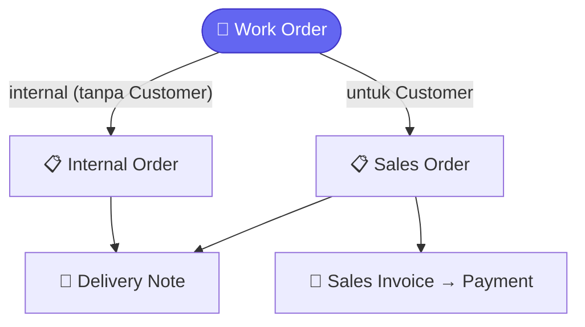
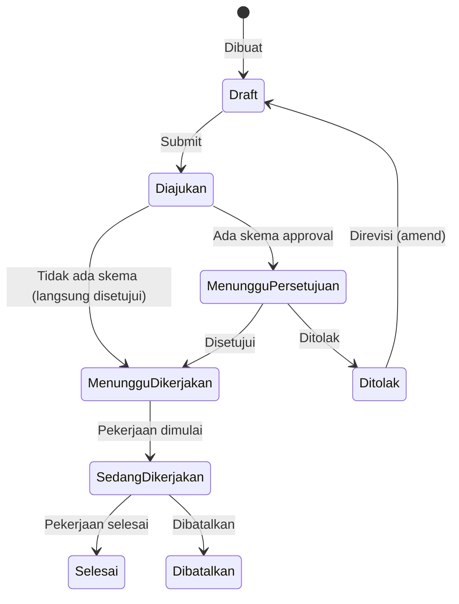
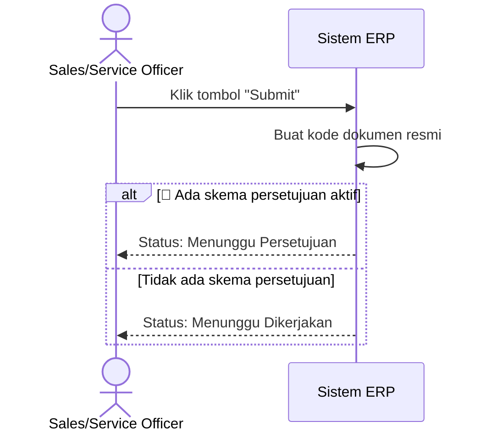
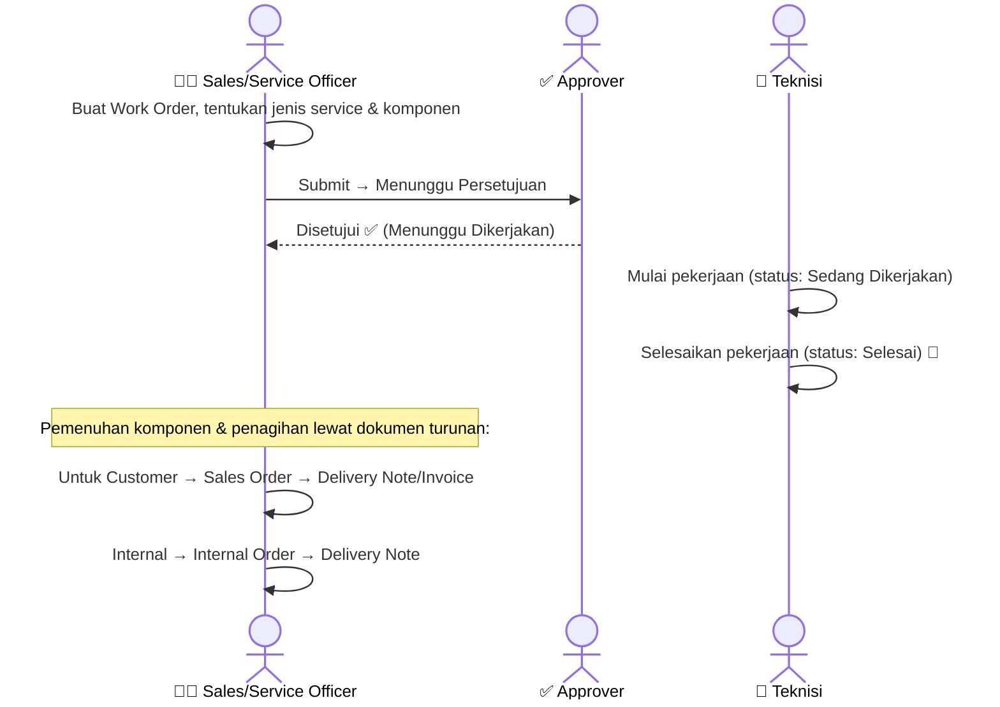

# Modul Service

> Dokumentasi modul service / pekerjaan: Work Orders.

## Daftar Isi

- [Gambaran Modul](#gambaran-modul)
- [Korelasi Antar-Feature](#korelasi-antar-feature)
- [Work Order](#work-order)
- [Business Flow](#business-flow)

---

## Gambaran Modul

Modul Service mengelola pekerjaan atau layanan yang diberikan kepada customer, maupun kebutuhan internal perusahaan (Work Order).

---

## Korelasi Antar-Feature

Work Order **tidak langsung** menyentuh stok atau buku besar. Work Order akan menghasilkan dokumen turunan tergantung jenisnya:

- **Untuk Customer** (ada customer yang dipilih) → berlanjut ke **Sales Order** → mengikuti [alur penjualan](sales.md#korelasi-antar-feature) (Delivery Note → Sales Invoice → Payment).
- **Internal** (tidak ada customer, untuk kebutuhan perusahaan sendiri) → berlanjut ke **Internal Order** → **Delivery Note**.

| Jenis Work Order | Mengarah ke | Lanjutan |
|---|---|---|
| **Untuk Customer** | [Sales Order](sales.md#sales-order) | Mengikuti [alur penjualan](sales.md#korelasi-antar-feature): Delivery Note → Sales Invoice → Payment |
| **Internal** | [Internal Order](sales.md#internal-order) | → [Delivery Note](inventory.md#delivery-note) |

> **Catatan:** Submit Work Order hanya membuat kode dokumen dan mengecek approval — Work Order **tidak** langsung memengaruhi stok atau buku besar. Efek stok & akuntansi baru terjadi di dokumen turunannya (Delivery Note, Sales Invoice). "Jenis Service" adalah pekerjaan yang dikerjakan (memilih Variant dari item), sedangkan "Komponen/Bahan" adalah material yang dipakai untuk mengerjakannya.

> Tiap komponen/bahan Work Order punya progres bertahap: diminta → dipesan → diterima → siap dipakai → sudah ditransfer ke lokasi kerja → sisa yang masih dibutuhkan. Komponen bisa punya alternatif pengganti jika stok utama tidak tersedia.

---

## Work Order

Work Order (WO) adalah dokumen pekerjaan/layanan yang diberikan ke customer atau untuk keperluan internal.

### Fields Utama

| Field | Deskripsi |
|---|---|
| Kode | Kode WO (dibuat otomatis) |
| Customer | Pelanggan (kosongkan untuk kebutuhan internal) |
| Cabang Customer | Cabang tujuan |
| Jenis Service | Layanan/pekerjaan yang dikerjakan |
| Tanggal | Tanggal WO dibuat |
| Catatan | Catatan tambahan |
| Waktu Mulai | Kapan pekerjaan mulai dikerjakan |
| Waktu Selesai | Kapan pekerjaan selesai |
| Baris Komponen | Komponen/bahan yang digunakan |

### Baris Komponen Work Order

| Field | Deskripsi |
|---|---|
| Item (Variant) | Komponen/bahan yang dipakai |
| Satuan | Satuan pengukuran |
| Jumlah Dibutuhkan | Total kebutuhan komponen |
| Sudah Dipesan | Progres pemesanan komponen |
| Sudah Diterima | Progres penerimaan komponen |
| Siap Dipakai | Jumlah yang sudah siap dipakai |
| Sudah Ditransfer | Jumlah yang sudah dipindahkan ke lokasi kerja |
| Sisa Dibutuhkan | Sisa kebutuhan yang belum terpenuhi |
| Keterangan | Catatan tambahan per baris |

### Alur Status Work Order

### Apa yang Terjadi Saat Anda Klik "Submit"

Pekerjaan dimulai dan diselesaikan lewat aksi terpisah — masing-masing mencatat tanggal mulai dan tanggal selesai secara otomatis.

---

## Business Flow

Kolaborasi antar peran dalam satu Work Order — dari dibuat sampai selesai dikerjakan:

> Work Order sendiri **tidak** menghasilkan catatan stok atau buku besar — efek itu baru muncul di dokumen turunannya. Lihat [Korelasi Antar-Feature](#korelasi-antar-feature).

---

## Related Documents

| Topik | Dokumen |
|---|---|
| Komponen & service → ItemVariant | [Inventory · Item & Variant](inventory.md#item--variant) |
| WO untuk Customer → Sales Order (lalu Delivery Note/Invoice/Payment) | [Sales · Sales Order](sales.md#sales-order) |
| WO internal → Internal Order → Delivery Note | [Sales · Internal Order](sales.md#internal-order) · [Inventory · Delivery Note](inventory.md#delivery-note) |
| Approval Work Order | [Core · Approval](core.md#approval) |
