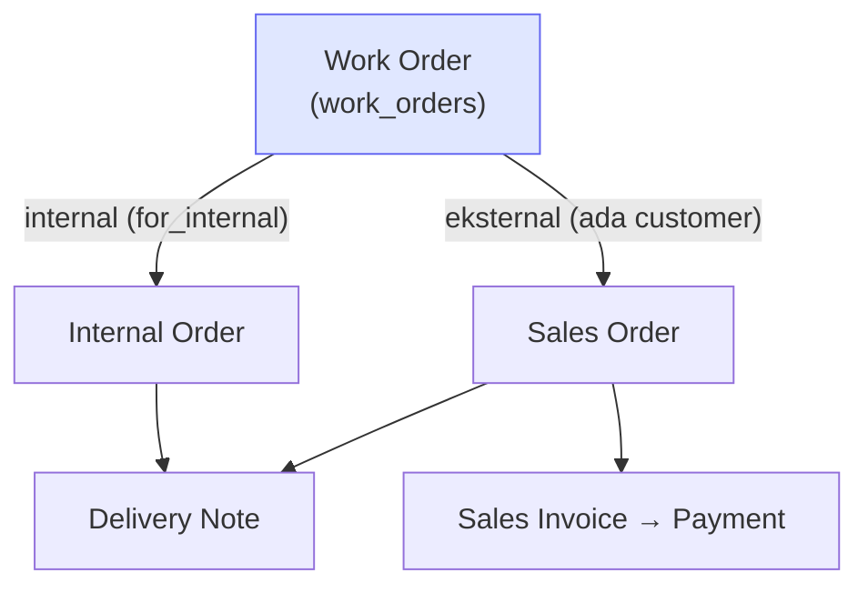
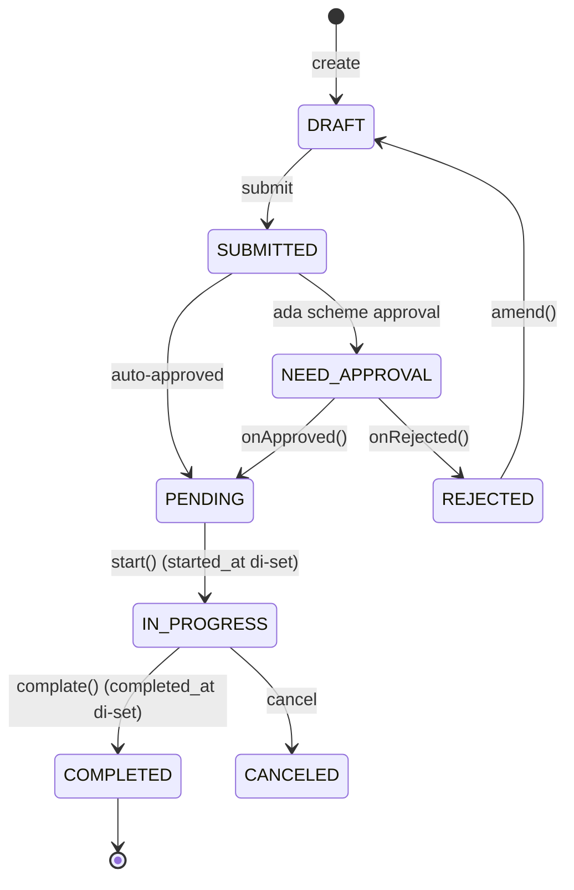
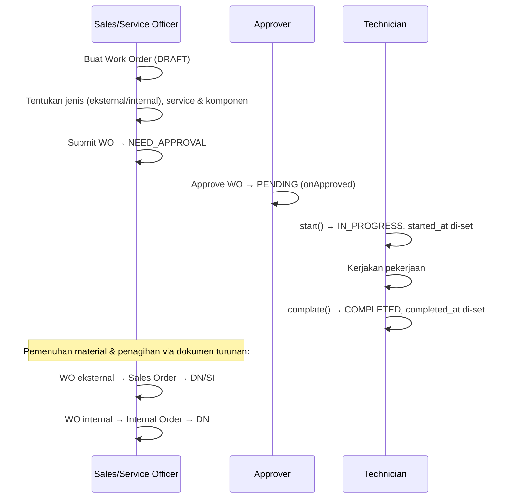

# Modul Service

> Dokumentasi modul service / pekerjaan: Work Orders.

## Daftar Isi

- [Gambaran Modul](#gambaran-modul)
- [Korelasi Antar-Feature](#korelasi-antar-feature)
- [Work Order](#work-order)
- [Business Flow](#business-flow)

---

## Gambaran Modul

Modul Service mengelola pekerjaan atau layanan yang diberikan kepada customer (work order / service order).

**Model utama:**

| Model | Tabel | Submitable |
|---|---|---|
| `WorkOrder` | `work_orders` | Ya |
| `WorkOrderItem` | `work_order_items` | — |
| `WorkOrderItemAlternative` | `work_order_item_alternatives` | — |

**Service:** `WorkOrderService`

---

## Korelasi Antar-Feature

Work Order **tidak** langsung menyentuh stok/GL. WO men-_spawn_ dokumen turunan tergantung jenisnya (`for_internal`):

- **WO eksternal** (ada `customer`) → **Sales Order** → lanjut [flow SO](sales.md#korelasi-antar-feature) (DN → SI → Payment).
- **WO internal** (`for_internal = true`, `customer_id = null`) → **Internal Order** → **Delivery Note**.



| Jenis WO | Penanda | Mengarah ke | Lanjutan |
|---|---|---|---|
| **Eksternal** | `customer_id` terisi | [Sales Order](sales.md#sales-order) | Ikut [flow SO](sales.md#korelasi-antar-feature): DN → SI → Payment |
| **Internal** | `for_internal` (`customer_id = null`) | [Internal Order](sales.md#internal-order) | → [Delivery Note](inventory.md#delivery-note) |

> `for_internal` adalah accessor: `true` saat `customer_id == null` (lihat `WorkOrder::forInternal()`).
>
> **Catatan:** `WorkOrderService::submit()` hanya generate kode + cek approval — WO **tidak** membuat StockLedgerEntry/GeneralLedger sendiri. Efek stok & akuntansi terjadi di dokumen turunan (DN, SI). `item_service` (relasi `itemService` → [ItemVariant](inventory.md#item--variant)) adalah jenis service yang dikerjakan; `items` adalah komponen/material.

> WorkOrderItem punya jalur quantity bertahap: `required` → `ordered` → `received` → `ready` → `transferred` → `remaining`. Alternatif komponen via `WorkOrderItemAlternative`.

---

## Work Order

Work Order (WO) adalah dokumen pekerjaan / layanan yang diberikan ke customer.

### Fields Utama

| Field | Tipe | Deskripsi |
|---|---|---|
| `code` | string | Kode WO (FormatingSeries) |
| `customer` | relation | Customer |
| `customer_branch` | relation | Cabang customer |
| `customer_name` | string | Denormalized nama customer |
| `item_service` | relation | Item jenis service yang dikerjakan |
| `item_service_name` | string | Denormalized nama service |
| `date` | datetime | Tanggal WO |
| `external_note` | text | Catatan |
| `started_at` | datetime | Waktu mulai dikerjakan |
| `completed_at` | datetime | Waktu selesai |
| `items` | hasMany | Komponen/bahan yang digunakan |
| `status` | json | Status aktif |

### Work Order Item Fields

| Field | Tipe | Deskripsi |
|---|---|---|
| `item_variant` | relation | → [ItemVariant](inventory.md#item--variant) (komponen/bahan yang digunakan) |
| `item_unit` | relation | Satuan (`ItemUnit`) |
| `quantity` | double | Jumlah dibutuhkan |
| `ordered_quantity` | double | Sudah di-order |
| `required_quantity` | double | Jumlah diperlukan |
| `received_quantity` | double | Sudah diterima |
| `ready_quantity` | double | Siap digunakan |
| `transferred_quantity` | double | Sudah ditransfer ke lokasi kerja |
| `remaining_quantity` | double | Sisa dibutuhkan |
| `description` | text | Keterangan |
| `referenceable_type/id` | polymorphic | Referensi dokumen |

### Status Workflow WO



> Sesuai `WorkOrderService`: approve → `PENDING`, lalu `start()` → `IN_PROGRESS`, `complate()` → `COMPLETED`.

### Submit Flow WO

Saat WO di-submit (`WorkOrderService::submit()`):
1. Generate kode final via FormatingSeries
2. Trigger `checkApproval()`
3. Jika approved → `onApproved()` set status `PENDING` (belum dikerjakan)

Pekerjaan dimulai terpisah via `start()` (→ `IN_PROGRESS`, set `started_at`) dan diselesaikan via `complate()` (→ `COMPLETED`, set `completed_at`).

### onApproved

```php
$workOrder->update([
    'status' => FormStatus::PENDING,
]);
```

### onRejected / cancel

```php
$workOrder->update(['status' => [FormStatus::REJECTED / CANCELED]]);
```

### Routes WO (submitable)

`Service\WorkOrderController`, prefix `/workOrders`. 12 route dasar + 6 submitable:

| Method | URI | Route Name | Controller@method |
|---|---|---|---|
| GET | `/workOrders` | `workOrders.index` | `WorkOrderController@index` |
| POST | `/workOrders` | `workOrders.store` | `WorkOrderController@store` |
| GET | `/workOrders/create/{ref?}` | `workOrders.create` | `WorkOrderController@create` |
| GET | `/workOrders/create-print-template` | `workOrders.createPrintTemplate` | `WorkOrderController@createPrintTemplate` |
| GET | `/workOrders/{workOrder}` | `workOrders.show` | `WorkOrderController@show` |
| PUT | `/workOrders/{workOrder}/{level?}` | `workOrders.update` | `WorkOrderController@update` |
| DELETE | `/workOrders/{workOrder}` | `workOrders.destroy` | `WorkOrderController@destroy` |
| PUT | `/workOrders/{workOrder}/submit` | `workOrders.submit` | `WorkOrderController@submit` |
| PUT | `/workOrders/{workOrder}/cancel` | `workOrders.cancel` | `WorkOrderController@cancel` |
| PUT | `/workOrders/{workOrder}/amend` | `workOrders.amend` | `WorkOrderController@amend` |
| GET | `/workOrders/{workOrder}/print/{printTemplate?}` | `workOrders.print` | `WorkOrderController@print` |
| POST/DELETE | `/workOrders/{workOrder}/comment[/{id}]` | `workOrders.addComment` / `removeComment` | `@addComment` / `@removeComment` |
| POST/DELETE | `/workOrders/{workOrder}/tag[/{id}]` | `workOrders.addTag` / `removeTag` | `@addTag` / `@removeTag` |
| POST/DELETE | `/workOrders/{workOrder}/file[/{id}]` | `workOrders.addFile` / `removeFile` | `@addFile` / `@removeFile` |

---

## Business Flow

### Flow Service Order



> Transisi status WO ditangani method service: `onApproved()` → `PENDING`, `start()` → `IN_PROGRESS`, `complate()` → `COMPLETED`. WO tidak menghasilkan jurnal/stok langsung — lihat [Korelasi](#korelasi-antar-feature).

---

## Frontend Pages

| Entitas | File |
|---|---|
| Work Order | `Pages/Services/WorkOrders/Index.jsx`, `ItemForm.jsx` |

Lihat [Frontend · Service](../frontend.md#service).

---

## Related Documents

| Topik | Dokumen |
|---|---|
| Komponen & service → ItemVariant | [Inventory · Item & Variant](inventory.md#item--variant) |
| WO eksternal → Sales Order (lalu DN/SI/Payment) | [Sales · Sales Order](sales.md#sales-order) · [Sales · Korelasi](sales.md#korelasi-antar-feature) |
| WO internal → Internal Order → DN | [Sales · Internal Order](sales.md#internal-order) · [Inventory · Delivery Note](inventory.md#delivery-note) |
| Approval WO | [Core · Approval](core.md#approval) · [Auth · Workflow](../auth.md#workflow-dokumen) |
| Tabel database | [Database · Domain Service](../database.md#domain-service) |
| Daftar route + Controller@method | [Routes · Service](../routes.md#13-service) |
| Halaman React | [Frontend · Service](../frontend.md#service) |
