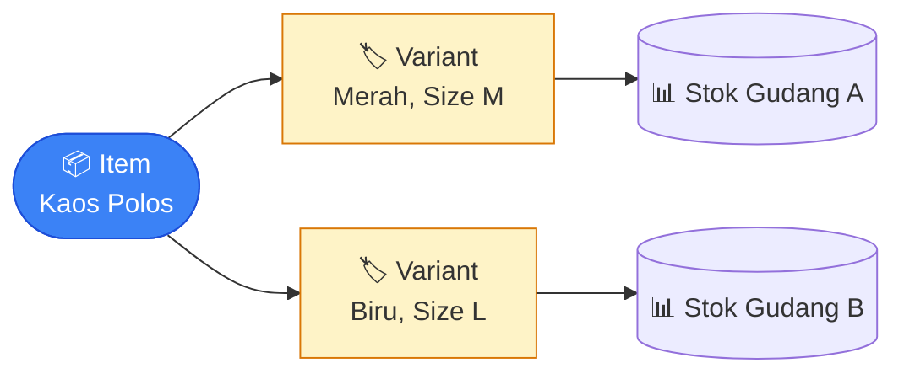

# Tutorial 2 — Membuat Item & Variant

> Membuat produk yang bisa dipakai di transaksi. **Penting:** transaksi memilih *Variant* (SKU), bukan Item master.

## Konsep

Satu Item bisa punya banyak Variant, dan tiap Variant punya stoknya sendiri per gudang. Detail: [Inventory · Item & Variant](../modules/inventory.md#item--variant).

## Langkah 1 — Buat Item

Menu **Inventory → Items → Tambah**.

| Field | Catatan |
|---|---|
| Kode, Nama | Identitas item |
| Kategori | Pilih dari daftar kategori |
| Satuan Dasar | Satuan default item |
| Track Stok | Aktifkan jika stok item perlu dipantau |
| Format Nama Variant | Pola nama variant otomatis |

## Langkah 2 — Tambah Unit Konversi (opsional)

Tab **Units** pada form item → tambah satuan tambahan (mis. 1 BOX = 12 PCS).

## Langkah 3 — Definisikan Variant

Tab **Variant**. Kombinasikan atribut (mis. Warna: Merah/Biru) → sistem otomatis membuat satu Variant per kombinasi.

- Tiap variant punya kode (SKU), stok, dan barcode sendiri.

## Langkah 4 — Barcode (opsional)

Tab **Barcodes** — tambahkan barcode per variant dan satuan.

## Langkah 5 — Stok Awal

Stok **tidak** diisi manual di form item. Gunakan **Stock Entry** tipe penerimaan:

→ Inventory → Stock Entries → tipe penerimaan. Lihat [Inventory · Stock Entry](../modules/inventory.md#stock-entry).

## Verifikasi

- Buka variant → tab stok menampilkan posisi per gudang.
- Variant kini muncul sebagai pilihan saat membuat SO/PO.

## Berikutnya

→ [Tutorial 3 — Alur Penjualan](03-alur-penjualan.md) · [Tutorial 4 — Alur Pembelian](04-alur-pembelian.md)
