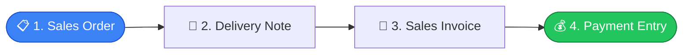
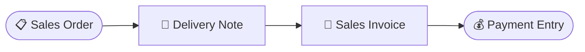
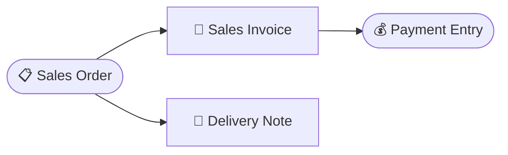

# Tutorial 3 — Alur Penjualan: SO → DN → SI → Payment

> Skenario lengkap penjualan: order, kirim barang, tagih, terima pembayaran.

> **Dua urutan didukung (dual flow).** Tutorial ini memakai urutan _kirim-dulu_ (Langkah 1-5). Untuk urutan _tagih-dulu_ lihat [Variasi: Dual Flow](#variasi-dual-flow). Langkah Delivery Note dan Sales Invoice **independen** — jumlah terkirim dan jumlah tertagih dicatat terpisah, jadi boleh dibalik urutannya.

## Langkah 1 — Buat Sales Order

Menu **Sales → Sales Orders → Tambah**.

1. Pilih customer.
2. Tambah baris item: pilih **Variant**, jumlah, satuan, harga, pajak, dan gudang asal.
3. **Save** → status Draft.
4. **Submit**:
   - Kode dokumen final dibuat otomatis.
   - Stok direservasi di gudang asal.
   - Sistem mengecek approval ([Tutorial 5](05-approval-scheme.md)). Jika tidak ada skema approval → status berubah menjadi Siap Dikirim & Siap Ditagih.

## Langkah 2 — Delivery Note (kirim barang)

Dari SO yang sudah berstatus Siap Dikirim, buat **Delivery Note**.

1. Sales/Warehouse → Delivery Notes → Tambah, referensikan SO (atau via tombol di SO).
2. Submit DN:
   - Stok **keluar** dari gudang asal.
   - Jumlah terkirim di SO bertambah.
   - SO status → Sebagian Terkirim / Terkirim.

Detail: [Inventory · Delivery Note](../modules/inventory.md#delivery-note).

## Langkah 3 — Sales Invoice (tagih)

Buat **Sales Invoice** dari SO.

1. Finances → Sales Invoices → Tambah, pilih SO.
2. Submit SI:
   - Piutang bertambah, pendapatan tercatat di buku besar.
   - Jumlah tertagih di SO bertambah → SO status → Sebagian Ditagih / Ditagih.

## Langkah 4 — Payment Entry (terima bayar)

1. Finances → Payment Entries → Tambah, pilih tipe "Terima".
2. Pilih Sales Invoice yang dibayar dan Customer sebagai pihak pembayar.
3. Submit:
   - Kas/bank bertambah, piutang berkurang di buku besar.
   - Jumlah terbayar di SI naik, sisa tagihan turun → status Lunas saat sudah penuh.
   - Jadwal pembayaran invoice ikut diperbarui (dialokasikan berurutan per jatuh tempo).

## Langkah 5 — SO Closed

Saat semua terkirim & tertagih → SO berstatus Selesai.

---

## Variasi: Dual Flow

SO mencatat progres kirim dan progres tagih secara **terpisah** per baris item. Karena itu DN dan SI tidak saling bergantung — dua urutan valid:

### Flow A — Kirim Dulu (default tutorial ini)

Urut: SO → **Delivery Note** (Langkah 2) → **Sales Invoice** (Langkah 3) → Payment. Cocok bila barang dikirim sebelum ditagih.

### Flow B — Tagih Dulu

Tukar urutan: setelah SO disetujui (status Siap Dikirim & Siap Ditagih):

1. **Buat Sales Invoice dulu** (Langkah 3) → SO status Ditagih.
2. Boleh terima pembayaran (Langkah 4) sebelum barang keluar.
3. **Baru buat Delivery Note** (Langkah 2) → SO status Terkirim.
4. SO Selesai saat dua-duanya tuntas.

Cocok untuk penjualan dengan pembayaran di muka (DP/lunas sebelum kirim).

> Keduanya berakhir di status Selesai. Yang menentukan status akhir bukan urutan, tapi apakah pengiriman dan penagihan sudah tuntas semua.

## Catatan

- **Cancel** dokumen mana pun mengembalikan (reverse) efeknya di buku besar dan stok.
- **Retur penjualan**: barang kembali → [Sales Return (DN retur)](retur.md#1-sales-return-dn-retur); koreksi tagihan → [Credit Note (SI retur)](retur.md#2-credit-note-sales-invoice-retur). Lihat [Tutorial Retur](retur.md).
