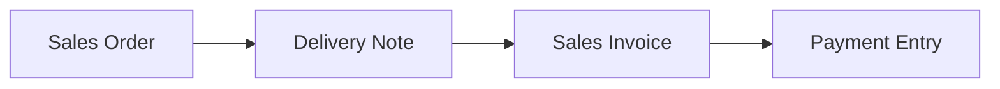
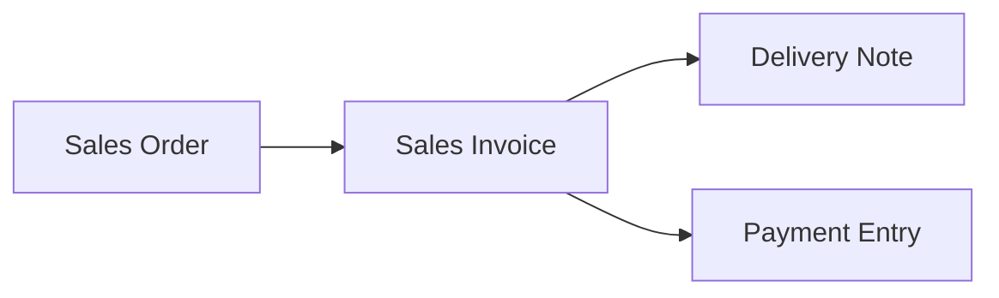

# Tutorial 3 — Alur Penjualan: SO → DN → SI → Payment

> Skenario lengkap penjualan: order, kirim barang, tagih, terima pembayaran.

Diagram korelasi: [Sales · Korelasi](../modules/sales.md#korelasi-antar-feature).

> **Dua urutan didukung (dual flow).** Tutorial ini memakai urutan _deliver-first_ (Langkah 1-5). Untuk urutan _bill-first_ lihat [Variasi: Dual Flow](#variasi-dual-flow). Tahap Delivery Note (Langkah 2) dan Sales Invoice (Langkah 3) **independen** — keduanya menempel ke SO via `delivered_quantity` & `billed_quantity` terpisah, jadi boleh dibalik urutannya.

## Langkah 1 — Buat Sales Order

Menu **Sales → Sales Orders → Tambah**.

1. Pilih `customer` ([CustomerLinkModel](../frontend.md#peta-linkmodel-relasi-ui)).
2. Tambah baris item (`ItemForm.jsx`): pilih **Variant** ([ItemVariantLinkModel](../frontend.md#peta-linkmodel-relasi-ui)), `quantity`, `unit`, `price`, `tax`, `source_warehouse`.
3. **Save** → status `DRAFT` (`POST /salesOrders`).
4. **Submit** → `PUT /salesOrders/{id}/submit`:
   - Generate kode final (FormatingSeries).
   - Reservasi stok di source warehouse.
   - Cek approval ([Tutorial 5](05-approval-scheme.md)). Jika tidak ada scheme → status `[TO_DELIVER, TO_BILL]`.

Route lengkap: [Sales · Routes SO](../modules/sales.md#routes-so-submitable).

## Langkah 2 — Delivery Note (kirim barang)

Dari SO yang sudah `TO_DELIVER`, buat **Delivery Note**.

1. Sales/Warehouse → Delivery Notes → Tambah, referensikan SO (atau via tombol di SO).
2. Submit DN (`PUT /deliveryNotes/{id}/submit`):
   - Stok **keluar** dari `source_warehouse` → `StockLedgerEntry`.
   - SO item `delivered_quantity` bertambah.
   - SO status → `PARTIALLY_DELIVERED` / `DELIVERED`.

Detail: [Inventory · Delivery Note](../modules/inventory.md#delivery-note).

## Langkah 3 — Sales Invoice (tagih)

Buat **Sales Invoice** dari SO.

1. Finances → Sales Invoices → Tambah, pilih SO ([SalesOrderLinkModel](../frontend.md#peta-linkmodel-relasi-ui)).
2. Submit SI (`PUT /salesInvoices/{id}/submit`):
   - GL: **debit** piutang (`debit_account`), **credit** pendapatan (`income_account`).
   - SO item `billed_quantity` bertambah → SO `PARTIALLY_BILLED`/`BILLED`.

## Langkah 4 — Payment Entry (terima bayar)

1. Finances → Payment Entries → Tambah, `payment_type: receive`.
2. `paymentable` → Sales Invoice; `partyable` → Customer.
3. Submit (`PUT /paymentEntries/{id}/submit`):
   - GL: **debit** kas/bank, **credit** piutang.
   - SI `paid_amount` naik, `outstanding_amount` turun → status `PAID` saat lunas.
   - **Payment Schedule** invoice diupdate: `paid_amount` dialokasikan FIFO per jatuh tempo → `outstanding_amount` jadwal turun. Lihat [Finances · Submit Flow PE](../modules/finances.md#submit-flow-pe).

## Langkah 5 — SO Closed

Saat semua terkirim & tertagih → SO `CLOSED`.

---

## Variasi: Dual Flow

SO menyimpan progres kirim dan tagih di kolom **terpisah** per item (`delivered_quantity`/`undelivered_quantity` vs `billed_quantity`/`unbilled_quantity`). Karena itu DN dan SI tidak saling bergantung — dua urutan valid:

### Flow A — Deliver-first (kirim dulu, default tutorial ini)

Urut: SO → **DN** (Langkah 2) → **SI** (Langkah 3) → PE. Cocok bila barang dikirim sebelum ditagih.

### Flow B — Bill-first (tagih dulu)

Tukar urutan: setelah SO approved (`[TO_DELIVER, TO_BILL]`):

1. **Buat Sales Invoice dulu** (Langkah 3) → SO `BILLED`.
2. Boleh terima pembayaran (Langkah 4) sebelum barang keluar.
3. **Baru buat Delivery Note** (Langkah 2) → SO `DELIVERED`.
4. SO `CLOSED` saat dua-duanya tuntas.

Cocok untuk penjualan dengan pembayaran di muka (DP/lunas sebelum kirim).

> Keduanya berakhir di `CLOSED`. Yang menentukan status akhir bukan urutan, tapi apakah `delivered` & `billed` sudah penuh. Konsep: [Sales · Dual Flow](../modules/sales.md#dual-flow-so--dn--si-atau-so--si--dn).

## Catatan

- **Cancel** dokumen mana pun → [`Submitable`](../modules/core.md#trait-submitable) mereverse GL & Stock Ledger terkait.
- **Retur penjualan**: barang kembali → [Sales Return (DN retur)](retur.md#1-sales-return-dn-retur); koreksi tagihan → [Credit Note (SI retur)](retur.md#2-credit-note-sales-invoice-retur). Lihat [Tutorial Retur](retur.md).

---

*Lihat: [Sales](../modules/sales.md) · [Finances](../modules/finances.md) · [Inventory](../modules/inventory.md)*
