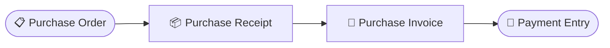
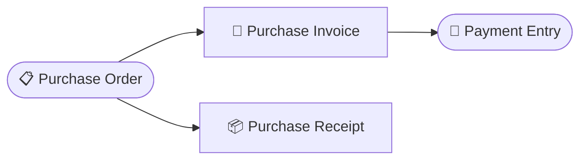

# Tutorial 4 — Alur Pembelian: PR → PO → GR → PI → Payment

> Skenario lengkap pengadaan: minta, pesan, terima barang, terima tagihan, bayar.

> **Dua urutan didukung (dual flow).** Tutorial ini memakai _receive-first_ (Langkah 3 lalu 4). Untuk _bill-first_ lihat [Variasi: Dual Flow](#variasi-dual-flow). Purchase Receipt (Langkah 3) dan Purchase Invoice (Langkah 4) **independen** — progres terima dan progres tagih dicatat terpisah, jadi urutannya boleh dibalik.

## Langkah 1 — Purchase Request (opsional)

Menu **Purchase → Purchase Requests → Tambah**. Permintaan internal pengadaan.

- Submit → setelah disetujui, status berubah menjadi Disetujui / Siap Dipesan.

## Langkah 2 — Purchase Order

Menu **Purchase → Purchase Orders → Tambah**.

1. Pilih supplier.
2. Tambah baris item: pilih **Variant**, jumlah, satuan, harga, pajak, dan gudang tujuan.
   - Atau gunakan tombol **"Sync dari PR"** untuk mengisi otomatis dari Purchase Request.
3. Submit:
   - Kode dokumen final dibuat otomatis, sistem mengecek approval.
   - Sistem mencatat tautan ke baris Purchase Request terkait dan memperbarui jumlah yang sudah dipesan di PR.
   - Status → Siap Diterima & Siap Ditagih.

## Langkah 3 — Purchase Receipt / GR (terima barang)

Dari PO yang sudah Siap Diterima, buat **Purchase Receipt**.

1. Purchase → Purchase Receipts → Tambah, pilih PO.
2. Submit GR:
   - Stok **masuk** ke gudang tujuan (dihitung dengan metode FIFO).
   - Jumlah diterima di PO bertambah → PO status → Sebagian Diterima / Diterima.

## Langkah 4 — Purchase Invoice (terima tagihan)

1. Finances → Purchase Invoices → Tambah, pilih PO.
2. Submit PI:
   - Persediaan/beban bertambah, hutang tercatat di buku besar.
   - Jumlah tertagih di PO bertambah → PO status → Ditagih.

## Langkah 5 — Payment Entry (bayar supplier)

1. Finances → Payment Entries → Tambah, pilih tipe "Bayar".
2. Pilih Purchase Invoice yang dibayar dan Supplier sebagai pihak penerima.
3. Submit:
   - Hutang berkurang, kas/bank berkurang di buku besar.
   - Jumlah terbayar di PI naik, sisa tagihan turun.
   - Jadwal pembayaran PI ikut diperbarui (dialokasikan berurutan per jatuh tempo).

---

## Variasi: Dual Flow

PO mencatat progres terima dan progres tagih secara **terpisah** per baris item. GR dan PI independen → dua urutan valid:

### Flow A — Terima Dulu (default tutorial ini)

Urut: PO → **Purchase Receipt** (Langkah 3) → **Purchase Invoice** (Langkah 4) → Payment. Cocok bila barang diterima sebelum tagihan datang.

### Flow B — Tagih Dulu

Setelah PO disetujui (status Siap Diterima & Siap Ditagih):

1. **Buat Purchase Invoice dulu** (Langkah 4) → PO status Ditagih.
2. Boleh bayar supplier (Langkah 5) di muka.
3. **Baru buat Purchase Receipt** (Langkah 3) saat barang datang → PO status Diterima.
4. PO Selesai saat terima & tagih tuntas.

Cocok untuk pembelian dengan pembayaran di muka ke supplier.

> Status akhir Selesai ditentukan oleh penerimaan dan penagihan yang sudah tuntas, bukan urutan.

## Catatan

- **Retur pembelian**: barang ke supplier → [Purchase Return (GR retur)](retur.md#3-purchase-return-gr-retur); koreksi tagihan → [Debit Note (PI retur)](retur.md#4-debit-note-purchase-invoice-retur). Lihat [Tutorial Retur](retur.md).
- Ada tombol **"Tandai Selesai"** untuk menutup PO secara manual tanpa harus menerima barang secara penuh.
