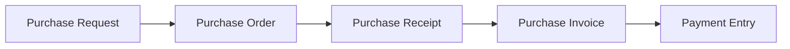
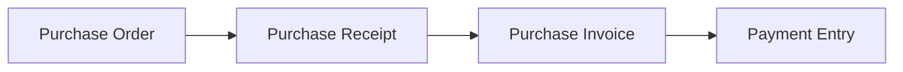
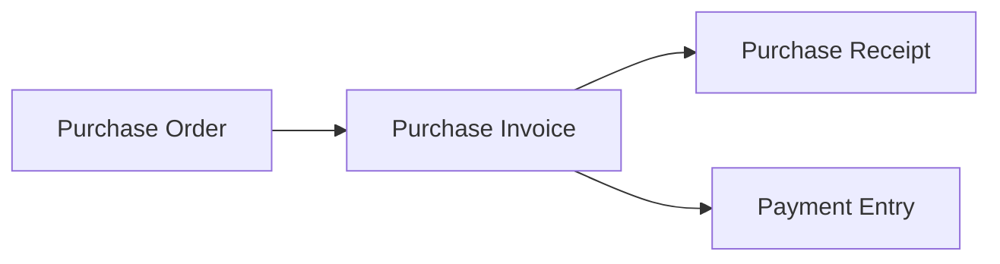

# Tutorial 4 — Alur Pembelian: PR → PO → GR → PI → Payment

> Skenario lengkap pengadaan: minta, pesan, terima barang, terima tagihan, bayar.

Diagram korelasi: [Purchase · Korelasi](../modules/purchase.md#korelasi-antar-feature).

> **Dua urutan didukung (dual flow).** Tutorial ini memakai _receive-first_ (Langkah 3 lalu 4). Untuk _bill-first_ lihat [Variasi: Dual Flow](#variasi-dual-flow). Purchase Receipt (Langkah 3) dan Purchase Invoice (Langkah 4) **independen** — PO melacak `received_quantity` & `billed_quantity` terpisah, jadi urutannya boleh dibalik.

## Langkah 1 — Purchase Request (opsional)

Menu **Purchase → Purchase Requests → Tambah**. Permintaan internal pengadaan.

- Submit (`PUT /purchaseRequests/{id}/submit`) → setelah approve, status `APPROVED`/`TO_ORDER`.

## Langkah 2 — Purchase Order

Menu **Purchase → Purchase Orders → Tambah**.

1. Pilih `supplier` ([SupplierLinkModel](../frontend.md#peta-linkmodel-relasi-ui)).
2. Tambah item (`ItemForm.jsx`): **Variant**, `quantity`, `unit`, `rate`, `tax`, `target_warehouse`.
   - Atau **sync dari PR**: `POST /purchaseOrders/{id}/sync-items` (`syncItems`).
3. Submit (`PUT /purchaseOrders/{id}/submit`):
   - Generate kode, cek approval.
   - Buat `ModelConnection` ke PR item, update `ordered_quantity` PR.
   - Status `[TO_RECEIVE, TO_BILL]`.

Route lengkap: [Purchase · Routes PO](../modules/purchase.md#routes-po-submitable).

## Langkah 3 — Purchase Receipt / GR (terima barang)

Dari PO `TO_RECEIVE`, buat **Purchase Receipt**.

1. Purchase → Purchase Receipts → Tambah, pilih PO ([PurchaseOrderLinkModel](../frontend.md#peta-linkmodel-relasi-ui)).
2. Submit GR (`PUT /purchaseReceipts/{id}/submit`):
   - Stok **masuk** ke `target_warehouse` → `StockLedgerEntry` (valuasi FIFO).
   - PO item `received_quantity` bertambah → PO `PARTIALLY_RECEIVED`/`RECEIVED`.

## Langkah 4 — Purchase Invoice (terima tagihan)

1. Finances → Purchase Invoices → Tambah, pilih PO.
2. Submit PI (`PUT /purchaseInvoices/{id}/submit`):
   - GL: **debit** persediaan/beban (`expanse_head_account`), **credit** hutang (`credit_account`).
   - PO item `billed_quantity` → PO `BILLED`.

## Langkah 5 — Payment Entry (bayar supplier)

1. Finances → Payment Entries → Tambah, `payment_type: pay`.
2. `paymentable` → Purchase Invoice; `partyable` → Supplier.
3. Submit:
   - GL: **debit** hutang, **credit** kas/bank.
   - PI `paid_amount` naik, `outstanding_amount` turun.
   - **Payment Schedule** PI diupdate: alokasi FIFO ke `paid_amount` per jatuh tempo → `outstanding_amount` jadwal turun. Lihat [Finances · Submit Flow PE](../modules/finances.md#submit-flow-pe).

---

## Variasi: Dual Flow

PO melacak progres terima dan tagih di kolom **terpisah** per item (`received_quantity`/`unreceived_quantity` vs `billed_quantity`). GR dan PI independen → dua urutan valid:

### Flow A — Receive-first (terima dulu, default tutorial ini)

Urut: PO → **GR** (Langkah 3) → **PI** (Langkah 4) → PE. Cocok bila barang diterima sebelum tagihan datang.

### Flow B — Bill-first (tagih dulu)

Setelah PO approved (`[TO_RECEIVE, TO_BILL]`):

1. **Buat Purchase Invoice dulu** (Langkah 4) → PO `BILLED`.
2. Boleh bayar supplier (Langkah 5) di muka.
3. **Baru buat Purchase Receipt** (Langkah 3) saat barang datang → PO `RECEIVED`.
4. PO `CLOSED` saat terima & tagih tuntas.

Cocok untuk pembelian dengan pembayaran di muka ke supplier.

> Status akhir `CLOSED` ditentukan oleh `received` & `billed` penuh, bukan urutan. Konsep: [Purchase · Korelasi](../modules/purchase.md#korelasi-antar-feature).

## Catatan

- **Retur pembelian**: barang ke supplier → [Purchase Return (GR retur)](retur.md#3-purchase-return-gr-retur); koreksi tagihan → [Debit Note (PI retur)](retur.md#4-debit-note-purchase-invoice-retur). Lihat [Tutorial Retur](retur.md).
- **markDone**: tandai PO selesai manual tanpa receipt penuh (`POST /purchaseOrders/{id}/mark-done`).

---

*Lihat: [Purchase](../modules/purchase.md) · [Finances](../modules/finances.md) · [Inventory](../modules/inventory.md)*
