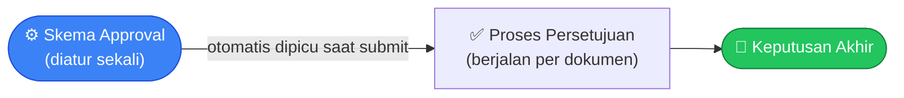

# Tutorial 5 — Menyiapkan Skema Persetujuan (Approval)

> Mengaktifkan persetujuan berjenjang sebelum dokumen melanjutkan alurnya.

Konsep dasar: [Core · Approval](../modules/core.md#approval).

## Langkah 1 — Buat Skema

Menu **Settings → Approval Schemes → Tambah**.

| Field | Catatan |
|---|---|
| Nama | Nama skema |
| Jenis Dokumen | Dokumen yang dikenai skema ini (mis. Sales Order) |
| Trigger | Kapan skema dijalankan (mis. saat submit) |
| Aktif | Aktifkan skema (hanya boleh 1 skema aktif per jenis dokumen) |

## Langkah 2 — Tambah Langkah Persetujuan

Tiap langkah approval:

| Field | Catatan |
|---|---|
| Urutan | Urutan langkah (langkah 1, 2, 3, dst.) |
| Tipe Penyetuju | Role tertentu atau User tertentu |
| Penyetuju | Role/User yang dipilih untuk menyetujui langkah ini |

## Langkah 3 — Uji Submit

1. Buat & submit dokumen target (mis. Sales Order).
2. Karena ada scheme aktif → dokumen berstatus Menunggu Persetujuan, dan instance approval beserta langkahnya otomatis terbentuk.

## Langkah 4 — Proses Approval

Menu **Approvals** — daftar dokumen yang menunggu persetujuan Anda.

- Approver membuka detail dokumen, klik **Approve** atau **Reject**.
- Semua langkah disetujui → dokumen lanjut ke status berikutnya (mis. Siap Dikirim/Siap Diterima).
- Salah satu langkah ditolak → dokumen berstatus Ditolak (bisa di-**amend** untuk revisi).

## Catatan

- Tanpa scheme aktif → dokumen langsung disetujui otomatis saat submit.
- Saat update dokumen di tengah proses approval, ada indikator level approval yang menandai tahap mana yang sedang diperbarui.

---

*Lihat: [Core · Approval](../modules/core.md#approval) · [Auth · Workflow](../auth.md#workflow-dokumen)*
