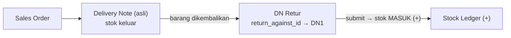
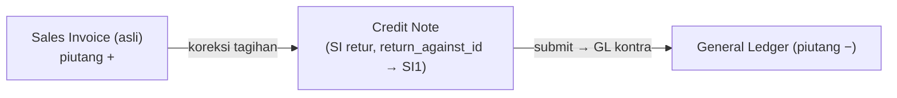
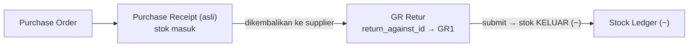
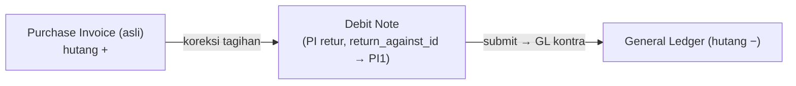

# Tutorial — Retur: Sales Return, Credit Note, Purchase Return, Debit Note

> Semua proses retur dalam satu dokumen. Prasyarat: pahami [Tutorial 3 — Alur Penjualan](03-alur-penjualan.md) (untuk Sales Return & Credit Note) dan [Tutorial 4 — Alur Pembelian](04-alur-pembelian.md) (untuk Purchase Return & Debit Note).

## Konsep Umum

Retur **bukan** dokumen jenis baru — melainkan **dokumen bertipe sama** (DN / GR / Sales Invoice / Purchase Invoice) yang menunjuk dokumen asli via `return_against_id` (header) dan `return_against_item_id` (per baris). Pisahkan dua sisi:

| Sisi | Pergerakan **barang** (stok) | Koreksi **tagihan** (akuntansi) |
|---|---|---|
| **Penjualan** ([Tutorial 3](03-alur-penjualan.md)) | [Sales Return](#1-sales-return-dn-retur) — DN retur, stok **+** | [Credit Note](#2-credit-note-sales-invoice-retur) — SI retur, piutang **−** |
| **Pembelian** ([Tutorial 4](04-alur-pembelian.md)) | [Purchase Return](#3-purchase-return-gr-retur) — GR retur, stok **−** | [Debit Note](#4-debit-note-purchase-invoice-retur) — PI retur, hutang **−** |

> **Tidak ada** dokumen "Credit Note"/"Debit Note" terpisah — istilah akuntansi untuk **invoice retur** (Sales/Purchase Invoice dengan `return_against`).
>
> Saat dokumen retur di-**cancel**, [`Submitable`](../modules/core.md#trait-submitable) otomatis mereverse GL & Stock Ledger entri retur.

## Daftar Isi

- [1. Sales Return (DN retur)](#1-sales-return-dn-retur)
- [2. Credit Note (Sales Invoice retur)](#2-credit-note-sales-invoice-retur)
- [3. Purchase Return (GR retur)](#3-purchase-return-gr-retur)
- [4. Debit Note (Purchase Invoice retur)](#4-debit-note-purchase-invoice-retur)

---

## 1. Sales Return (DN Retur)

> Mengembalikan barang yang sudah dikirim ke customer → stok **masuk** kembali. Lanjutan dari [Tutorial 3 · Delivery Note](03-alur-penjualan.md#langkah-2--delivery-note-kirim-barang).

**Prasyarat:** DN asli sudah ter-submit.

### Langkah

1. Buka **Delivery Note asli** → aksi **Retur** → DN baru, `return_against_id` terisi otomatis.
2. Per baris: isi `quantity` yang dikembalikan (`return_against_item_id` → baris DN asli), pilih `source_warehouse` tujuan barang retur.
3. **Save** (DRAFT) → **Submit** (`PUT /deliveryNotes/{id}/submit`).

### Efek submit (setelah approve)

- Stok **masuk kembali** ke `source_warehouse` → `StockLedgerEntry` `quantity_change` positif.
- `returnAgainstItem.returned_quantity` di DN asli bertambah.
- Status SO di-recalculate; status DN retur → `RETURNED`.

> Koreksi nilai tagihan dilakukan terpisah via [Credit Note](#2-credit-note-sales-invoice-retur). Relasi: [Model · DeliveryNote](../models.md#deliverynote).

---

## 2. Credit Note (Sales Invoice Retur)

> Mengurangi tagihan ke customer. Lanjutan dari [Tutorial 3 · Sales Invoice](03-alur-penjualan.md#langkah-3--sales-invoice-tagih).

**Prasyarat:** Sales Invoice asli ter-submit. `SalesInvoice::isReturn()` = `return_against_id != null`.

### Langkah

1. Buka **Sales Invoice asli** → aksi **Retur** → SI baru dengan `return_against_id`.
2. Isi baris + `quantity` dikoreksi (`return_against_item_id` → baris SI asli).
3. **Save** → **Submit** (`PUT /salesInvoices/{id}/submit`).

### Efek submit (`SalesInvoiceService::onApproved()`, cabang `returnAgainst`)

1. Tiap baris: `returnAgainstItem.returned_quantity += qty`; `salesOrderItem.billed_quantity -= qty` (kebalikan invoice normal yang `+=`).
2. **GL dibalik**: debit pendapatan, credit piutang → mengurangi piutang dagang.
3. Status Credit Note → `RETURNED`; SI asli di-recalculate (`PAID`/`PARTIALLY_PAID`).

> Pengembalian fisik barang lewat [Sales Return](#1-sales-return-dn-retur). Relasi: [Model · SalesInvoice](../models.md#salesinvoice).

---

## 3. Purchase Return (GR Retur)

> Mengembalikan barang yang sudah diterima ke supplier → stok **keluar**. Lanjutan dari [Tutorial 4 · Purchase Receipt](04-alur-pembelian.md#langkah-3--purchase-receipt--gr-terima-barang).

**Prasyarat:** GR asli ter-submit.

### Langkah

1. Buka **Purchase Receipt asli** → aksi **Retur** → GR baru dengan `return_against_id`.
2. Per baris: isi `quantity` dikembalikan (`return_against_item_id` → baris GR asli), `target_warehouse` = gudang asal.
3. **Save** → **Submit** (`PUT /purchaseReceipts/{id}/submit`).

### Efek submit (`PurchaseReceiptService::onApproved()`, cabang `returnAgainst`)

1. Stok **keluar**: FIFO queue di-rollback (cari entri `rate` cocok, kurangi qty), `stock.quantity -= qty`.
2. `StockLedgerEntry` `quantity_change = -qty`, `change_in_stock_value = -(rate × qty)`.
3. `returnAgainstItem.returned_quantity += qty`; PO item `received_quantity -= qty`.
4. **GL kontra**: debit SRNB (Stock Received But Not Billed), credit akun stok.
5. Status GR retur → `RETURNED`; status PO di-recalculate.

> Koreksi tagihan via [Debit Note](#4-debit-note-purchase-invoice-retur). Relasi: [Model · PurchaseReceipt](../models.md#purchasereceipt).

---

## 4. Debit Note (Purchase Invoice Retur)

> Mengurangi tagihan dari supplier. Lanjutan dari [Tutorial 4 · Purchase Invoice](04-alur-pembelian.md#langkah-4--purchase-invoice-terima-tagihan).

**Prasyarat:** Purchase Invoice asli ter-submit.

### Langkah

1. Buka **Purchase Invoice asli** → aksi **Retur** → PI baru dengan `return_against_id`.
2. Isi baris + `quantity` dikoreksi (`return_against_item_id` → baris PI asli).
3. **Save** → **Submit** (`PUT /purchaseInvoices/{id}/submit`).

### Efek submit (cabang `returnAgainst`)

1. Tiap baris: `returnAgainstItem.returned_quantity += qty`; PO item `billed_quantity` disesuaikan.
2. **GL dibalik**: debit hutang (`credit_account`), credit persediaan/beban (`expanse_head_account`) → mengurangi hutang.
3. Status Debit Note → `RETURNED`; PI asli & PO di-recalculate.

> Pengembalian fisik barang lewat [Purchase Return](#3-purchase-return-gr-retur). Relasi: [Model · PurchaseInvoice](../models.md#purchaseinvoice).

---

*Lihat: [Tutorial 3 — Alur Penjualan](03-alur-penjualan.md) · [Tutorial 4 — Alur Pembelian](04-alur-pembelian.md) · [Sales · Flow Retur](../modules/sales.md#flow-retur-returnagainst) · [Purchase · Flow Retur](../modules/purchase.md#flow-retur-returnagainst)*
