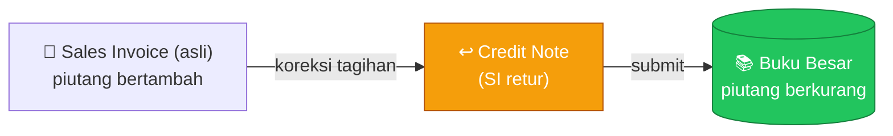
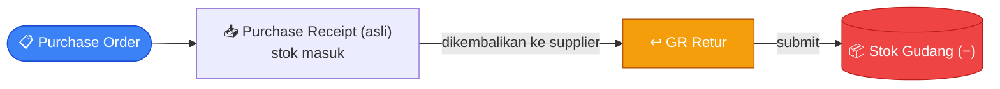
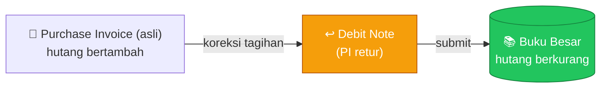

# Tutorial — Retur: Sales Return, Credit Note, Purchase Return, Debit Note

> Semua proses retur dalam satu dokumen. Prasyarat: pahami [Tutorial 3 — Alur Penjualan](03-alur-penjualan.md) (untuk Sales Return & Credit Note) dan [Tutorial 4 — Alur Pembelian](04-alur-pembelian.md) (untuk Purchase Return & Debit Note).

## Konsep Umum

Retur **bukan** dokumen jenis baru — melainkan **dokumen bertipe sama** (DN / GR / Sales Invoice / Purchase Invoice) yang menunjuk balik ke dokumen aslinya. Pisahkan dua sisi:

| Sisi | Pergerakan **barang** (stok) | Koreksi **tagihan** (akuntansi) |
|---|---|---|
| **Penjualan** ([Tutorial 3](03-alur-penjualan.md)) | [Sales Return](#1-sales-return-dn-retur) — DN retur, stok **+** | [Credit Note](#2-credit-note-sales-invoice-retur) — SI retur, piutang **−** |
| **Pembelian** ([Tutorial 4](04-alur-pembelian.md)) | [Purchase Return](#3-purchase-return-gr-retur) — GR retur, stok **−** | [Debit Note](#4-debit-note-purchase-invoice-retur) — PI retur, hutang **−** |

> **Tidak ada** dokumen "Credit Note"/"Debit Note" terpisah — istilah akuntansi untuk **invoice retur** (Sales/Purchase Invoice yang menunjuk balik ke invoice asli).
>
> Saat dokumen retur di-**cancel**, efeknya di buku besar dan stok otomatis dikembalikan (reverse).

## Daftar Isi

- [1. Sales Return (DN retur)](#1-sales-return-dn-retur)
- [2. Credit Note (Sales Invoice retur)](#2-credit-note-sales-invoice-retur)
- [3. Purchase Return (GR retur)](#3-purchase-return-gr-retur)
- [4. Debit Note (Purchase Invoice retur)](#4-debit-note-purchase-invoice-retur)

---

## 1. Sales Return (DN Retur)

> Mengembalikan barang yang sudah dikirim ke customer → stok **masuk** kembali. Lanjutan dari [Tutorial 3 · Delivery Note](03-alur-penjualan.md#langkah-2--delivery-note-kirim-barang).

**Prasyarat:** DN asli sudah ter-submit.

### Langkah

1. Buka **Delivery Note asli** → aksi **Retur** → DN baru otomatis menunjuk ke DN asli.
2. Per baris: isi jumlah yang dikembalikan, pilih gudang tujuan barang retur.
3. **Save** (Draft) → **Submit**.

### Efek submit (setelah disetujui)

- Stok **masuk kembali** ke gudang tujuan.
- Jumlah dikembalikan pada baris DN asli bertambah.
- Status SO ikut diperbarui; status DN retur → Selesai.

> Koreksi nilai tagihan dilakukan terpisah via [Credit Note](#2-credit-note-sales-invoice-retur).

---

## 2. Credit Note (Sales Invoice Retur)

> Mengurangi tagihan ke customer. Lanjutan dari [Tutorial 3 · Sales Invoice](03-alur-penjualan.md#langkah-3--sales-invoice-tagih).

**Prasyarat:** Sales Invoice asli sudah ter-submit.

### Langkah

1. Buka **Sales Invoice asli** → aksi **Retur** → SI baru otomatis menunjuk ke invoice asli.
2. Isi baris dengan jumlah yang dikoreksi.
3. **Save** → **Submit**.

### Efek submit

1. Jumlah yang ditagih pada Sales Order terkait dikurangi sesuai baris yang diretur.
2. **Buku besar dikoreksi**: piutang dagang berkurang.
3. Status Credit Note → Selesai; SI asli ikut diperbarui statusnya (Lunas/Sebagian Lunas).

> Pengembalian fisik barang lewat [Sales Return](#1-sales-return-dn-retur).

---

## 3. Purchase Return (GR Retur)

> Mengembalikan barang yang sudah diterima ke supplier → stok **keluar**. Lanjutan dari [Tutorial 4 · Purchase Receipt](04-alur-pembelian.md#langkah-3--purchase-receipt--gr-terima-barang).

**Prasyarat:** GR asli sudah ter-submit.

### Langkah

1. Buka **Purchase Receipt asli** → aksi **Retur** → GR baru otomatis menunjuk ke GR asli.
2. Per baris: isi jumlah yang dikembalikan, gudang asal barang.
3. **Save** → **Submit**.

### Efek submit

1. Stok **keluar** dari gudang, dihitung ulang mengikuti metode FIFO.
2. Jumlah dikembalikan pada baris GR asli bertambah; jumlah diterima di PO berkurang.
3. **Buku besar dikoreksi**: akun persediaan berkurang.
4. Status GR retur → Selesai; status PO ikut diperbarui.

> Koreksi tagihan via [Debit Note](#4-debit-note-purchase-invoice-retur).

---

## 4. Debit Note (Purchase Invoice Retur)

> Mengurangi tagihan dari supplier. Lanjutan dari [Tutorial 4 · Purchase Invoice](04-alur-pembelian.md#langkah-4--purchase-invoice-terima-tagihan).

**Prasyarat:** Purchase Invoice asli sudah ter-submit.

### Langkah

1. Buka **Purchase Invoice asli** → aksi **Retur** → PI baru otomatis menunjuk ke invoice asli.
2. Isi baris dengan jumlah yang dikoreksi.
3. **Save** → **Submit**.

### Efek submit

1. Jumlah yang ditagih pada PO terkait disesuaikan.
2. **Buku besar dikoreksi**: hutang berkurang, persediaan/beban berkurang.
3. Status Debit Note → Selesai; PI asli & PO ikut diperbarui.

> Pengembalian fisik barang lewat [Purchase Return](#3-purchase-return-gr-retur).

---

*Lihat: [Tutorial 3 — Alur Penjualan](03-alur-penjualan.md) · [Tutorial 4 — Alur Pembelian](04-alur-pembelian.md)*
